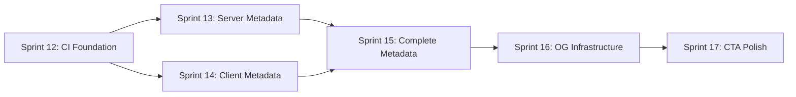

# Content Audit Remediation Plan v2

## Executive Summary

The content audit (`npm run audit:content`) revealed **43 pages** with the following issues:

| Issue Type | Count | Priority |
|------------|-------|----------|
| Missing page metadata | 17 | 🔴 Critical |
| No explicit OG image | 40 | 🟡 High |
| Missing CTAs | 9 | 🟡 High |
| Very thin pages (redirects) | 3 | 🟢 Low |
| Placeholder text | 1 | 🟡 High |
| Hardcoded URLs | 1 | 🟢 Low |
| Missing `og-default.png` | 1 | 🟡 High |

### Key Technical Constraints

1. **12 pages are 'use client' components** - Cannot use `export const metadata` directly. Must use separate `layout.tsx` files with metadata exports.

2. **Root layout has global OG config** - `app/layout.tsx` defines site-wide OpenGraph metadata. Pages without explicit OG inherit this.

3. **Redirect pages are thin by design** - `/demo`, `/security`, `/start-your-map` are intentional redirects (4 lines each).

4. **CI workflow already exists** - `.github/workflows/ci.yml` has test infrastructure ready.

5. **Vitest config requires path updates** - Script tests need to be added to include array.

### Client Component Pages (Cannot Export Metadata Directly)
- `/` (homepage)
- `/about`
- `/case-studies`
- `/diagnostic`
- `/network-effect`
- `/pricing`
- `/privacy`
- `/product`
- `/roi`
- `/singularity`
- `/terms`
- `/__test-error__`

### Server Component Pages (Can Export Metadata)
- `/changelog`
- `/compare/legacy-yms`
- `/compare/spreadsheets`
- `/demo`
- `/faq`
- `/integrations`
- `/press`
- `/security`
- `/start-your-map`
- `/status`

---

## Sprint Structure

### Sprint 12: CI Foundation & Test Page Cleanup
**Goal:** Add content audit to CI pipeline first (fail-fast), exclude test pages from audit  
**Demo:** CI runs content audit; test pages don't pollute results

### Sprint 13: Server Component Metadata
**Goal:** Add metadata to all server component pages (9 pages)  
**Demo:** `npm run audit:content` shows reduced "Missing metadata" count

### Sprint 14: Client Component Metadata Infrastructure  
**Goal:** Create layout.tsx pattern for client components; apply to critical pages  
**Demo:** Homepage, pricing, and diagnostic have proper metadata

### Sprint 15: Complete Metadata Coverage
**Goal:** Apply metadata pattern to all remaining client component pages  
**Demo:** 0 "Missing page metadata" issues in audit

### Sprint 16: OG Image Infrastructure
**Goal:** Create og-default.png, add dynamic OG to key pages, add OG validation tests  
**Demo:** Social share previews work; E2E test validates OG generation

### Sprint 17: CTA & Content Polish
**Goal:** Add CTAs to pages missing them, fix placeholder pattern, clean hardcoded URLs  
**Demo:** Audit passes with 0 actionable issues

---

## Sprint 12: CI Foundation & Test Page Cleanup

### Overview
- **Focus:** Establish CI enforcement first; clean up audit false positives
- **Success Criteria:** CI runs content audit; test pages excluded
- **Rationale:** Get CI protection before making changes (fail-fast pattern)

### T12-001: Add test directories to IGNORED_DIRS
**File:** `scripts/content-audit.ts`  
**Description:** Add `__test-error__` and `test-canvas` to the IGNORED_DIRS array to exclude test pages from audit.  
**Implementation:**
```typescript
const IGNORED_DIRS = ['api', 'og-preview', 'logo-preview', 'logo-test', '__test-error__', 'test-canvas'];
```
**Validation:**
```bash
npm run audit:content 2>&1 | grep -E "/__test-error__|/test-canvas"
# Should return empty (no matches)
```

### T12-002: Add redirect page detection to audit
**File:** `scripts/content-audit.ts`  
**Description:** Detect redirect-only pages and skip "thin page" warnings for them. These pages contain `redirect()` and have < 15 lines.  
**Implementation:**
```typescript
// In auditPage(), after reading content:
const isRedirectPage = /redirect\(['"]/.test(content) && lines.length < 15;

// In thin page check:
if (codeLines.length < 20 && !isRedirectPage) {
  audit.issues.push(`Very thin page (${codeLines.length} code lines)`);
}
```
**Validation:**
```bash
npm run audit:content 2>&1 | grep "Very thin page"
# Should return empty (redirect pages no longer flagged)
```

### T12-003: Fix placeholder detection false positive
**File:** `scripts/content-audit.ts`  
**Description:** The placeholder pattern matches legitimate HTML `placeholder="..."` attributes. Fix to only match standalone "placeholder" text, not HTML attributes.  
**Implementation:**
```typescript
// Change from:
/placeholder/i,
// To: Match placeholder NOT followed by = (attribute syntax)
/placeholder(?!\s*=)/i,
```
**Validation:**
```bash
npm run audit:content 2>&1 | grep -i "placeholder"
# Should not flag /yardbuilder for HTML placeholder attributes
```

### T12-004: Add content audit to CI workflow
**File:** `.github/workflows/ci.yml`  
**Description:** Add content audit step after build, before E2E tests.  
**Implementation:**
```yaml
      - name: Build
        run: npm run build

      - name: Content Audit
        run: npm run audit:content

      - name: Install Playwright browsers
        run: npx playwright install --with-deps chromium
```
**Validation:**
- Push branch → CI runs audit step
- Check workflow logs for "Content Audit" step

### T12-005: Add --ci flag for JSON output
**File:** `scripts/content-audit.ts`  
**Description:** Add CLI flag `--ci` that outputs JSON summary and uses consistent exit codes.  
**Implementation:**
```typescript
const isCI = process.argv.includes('--ci');

// In formatReport():
if (isCI) {
  console.log(JSON.stringify({
    totalPages: audits.length,
    pagesWithIssues: pagesWithIssues.length,
    pagesWithWarnings: pagesWithWarnings.length,
    issues: pagesWithIssues.map(a => ({ path: a.path, issues: a.issues })),
    assetIssues,
  }, null, 2));
  process.exit(pagesWithIssues.length + assetIssues.length > 0 ? 1 : 0);
  return;
}
// ... rest of human-readable output
```
**Validation:**
```bash
npm run audit:content -- --ci | jq .totalPages
# Should output: 43 (or current page count)
```

### T12-006: Sprint 12 validation & commit
**Description:** Run full validation and commit.  
**Commands:**
```bash
npm run typecheck
npm run test:unit
npm run audit:content
git add -A && git commit -m "feat(ci): Add content audit to CI, exclude test pages (Sprint 12)"
```
**Validation:**
- TypeScript: 0 errors
- Unit tests: All passing
- Audit: Fewer false positives

---

## Sprint 13: Server Component Metadata

### Overview
- **Focus:** Add metadata to pages that can directly export it (server components)
- **Success Criteria:** All 9 server component pages with missing metadata are fixed
- **Estimated Tasks:** 7

### T13-001: Add metadata to `/changelog`
**File:** `app/changelog/page.tsx`  
**Description:** Add Metadata export with SEO-optimized title/description.  
**Implementation:**
```typescript
import { Metadata } from 'next';

export const metadata: Metadata = {
  title: 'Changelog | YardFlow Product Updates',
  description: 'Release notes and product updates for YardFlow. Detailed changelog available to customers and prospects on request.',
};
```
**Validation:**
```bash
grep "export const metadata" app/changelog/page.tsx && npm run typecheck
```

### T13-002: Add metadata to `/compare/legacy-yms`
**File:** `app/compare/legacy-yms/page.tsx`  
**Description:** Add comparison-focused metadata.  
**Implementation:**
```typescript
export const metadata: Metadata = {
  title: 'YardFlow vs Legacy YMS | Feature Comparison',
  description: 'Compare YardFlow to traditional Yard Management Systems. See why enterprise freight networks choose our network-native approach.',
};
```
**Validation:** TypeScript passes; audit no longer flags page

### T13-003: Add metadata to `/compare/spreadsheets`
**File:** `app/compare/spreadsheets/page.tsx`  
**Implementation:**
```typescript
export const metadata: Metadata = {
  title: 'YardFlow vs Spreadsheet Tracking | Comparison',
  description: 'Why spreadsheets fail at scale for yard management. Compare manual tracking to YardFlow automation.',
};
```
**Validation:** TypeScript passes

### T13-004: Add metadata to `/faq`
**File:** `app/faq/page.tsx`  
**Implementation:**
```typescript
export const metadata: Metadata = {
  title: 'FAQ | YardFlow Questions Answered',
  description: 'Frequently asked questions about YardFlow implementation, pricing, integrations, and enterprise deployment.',
};
```
**Validation:** Audit passes for this page

### T13-005: Add metadata to `/integrations`
**File:** `app/integrations/page.tsx`  
**Implementation:**
```typescript
export const metadata: Metadata = {
  title: 'Integrations | TMS, WMS, ERP Connectivity',
  description: 'YardFlow integrates with your existing TMS, WMS, and ERP systems. API-first architecture for enterprise connectivity.',
};
```
**Validation:** Page removed from issues list

### T13-006: Add metadata to remaining server pages
**Files:**
- `app/press/page.tsx` → "Press & Media | YardFlow by FreightRoll"
- `app/status/page.tsx` → "System Status | YardFlow Platform"

**Description:** Add Metadata export to each server component page.  
**Validation:**
```bash
for f in app/press/page.tsx app/status/page.tsx; do
  grep -l "export const metadata" "$f" || echo "MISSING: $f"
done
```

### T13-007: Add metadata to redirect pages
**Files:**
- `app/demo/page.tsx`
- `app/security/page.tsx`
- `app/start-your-map/page.tsx`

**Description:** Although these redirect, add metadata for edge cases (direct navigation, crawlers).  
**Implementation:**
```typescript
import { Metadata } from 'next';
import { redirect } from 'next/navigation';

export const metadata: Metadata = {
  title: 'Demo | YardFlow',
  description: 'Request a demo of YardFlow.',
};

export default function DemoPage() {
  redirect('/contact?intent=demo');
}
```
**Validation:** All three have metadata exports

### T13-008: Sprint 13 validation & commit
**Commands:**
```bash
npm run typecheck
npm run test:unit
npm run audit:content 2>&1 | grep -c "Missing page metadata"
# Should be reduced to ~8 (remaining client component pages)
git add -A && git commit -m "feat(seo): Add metadata to server component pages (Sprint 13)"
```

---

## Sprint 14: Client Component Metadata Infrastructure

### Overview
- **Focus:** Establish pattern for 'use client' pages; apply to critical pages
- **Success Criteria:** Homepage, pricing, and diagnostic have metadata
- **Estimated Tasks:** 6

### T14-001: Create metadata helper documentation
**File:** `docs/page-metadata-patterns.md`  
**Description:** Document the pattern for adding metadata to 'use client' pages in Next.js App Router.  
**Content:**
- Pattern: Create `layout.tsx` in same directory with metadata export
- Why: 'use client' pages cannot export static metadata
- Examples for each approach
**Validation:** File exists with clear documentation

### T14-002: Add metadata layout for homepage (/)
**File:** Create `app/(home)/layout.tsx`  
**Description:** The homepage is critical for SEO. Create route group with layout for metadata.  
**Steps:**
1. Create `app/(home)/` directory
2. Move `app/page.tsx` to `app/(home)/page.tsx`
3. Create `app/(home)/layout.tsx` with metadata

**Implementation:**
```typescript
// app/(home)/layout.tsx
import { Metadata } from 'next';

export const metadata: Metadata = {
  title: 'YardFlow | Yard Network System for Enterprise Freight',
  description: 'Standardize yard operations across your entire freight network. Digital Guard, Digital Comms, Digital BOL, and Digital YMS in one platform.',
  openGraph: {
    title: 'YardFlow | Yard Network System',
    description: 'Standardize yard operations across your entire freight network.',
  },
};

export default function HomeLayout({ children }: { children: React.ReactNode }) {
  return children;
}
```
**Validation:**
```bash
npm run build  # Verify route works
curl -s http://localhost:3000 | grep -o '<title>[^<]*</title>'
# Should show homepage-specific title
```

### T14-003: Add metadata layout for `/pricing`
**File:** `app/pricing/layout.tsx`  
**Description:** Pricing page is high-value for conversions.  
**Implementation:**
```typescript
// app/pricing/layout.tsx
import { Metadata } from 'next';

export const metadata: Metadata = {
  title: 'Pricing | Per-Facility Annual Subscription | YardFlow',
  description: 'Transparent per-facility pricing for YardFlow. $5,000-$15,000/facility/year. One price, full platform, all four modules.',
};

export default function PricingLayout({ children }: { children: React.ReactNode }) {
  return children;
}
```
**Validation:** Audit no longer flags `/pricing`

### T14-004: Add metadata layout for `/diagnostic`
**File:** `app/diagnostic/layout.tsx`  
**Implementation:**
```typescript
export const metadata: Metadata = {
  title: 'Yard Diagnostic | Calculate Your Variance Tax',
  description: 'Calculate the hidden costs of yard variance across your freight network. Get a personalized ROI estimate.',
};

export default function DiagnosticLayout({ children }: { children: React.ReactNode }) {
  return children;
}
```
**Validation:** Audit passes for `/diagnostic`

### T14-005: Add metadata layout for `/singularity`
**File:** `app/singularity/layout.tsx`  
**Implementation:**
```typescript
export const metadata: Metadata = {
  title: 'Singularity | Network Simulation Engine',
  description: 'Enterprise-grade simulation engine for modeling yard network dynamics at scale.',
};

export default function SingularityLayout({ children }: { children: React.ReactNode }) {
  return children;
}
```
**Validation:** Audit passes

### T14-006: Sprint 14 validation & commit
**Commands:**
```bash
npm run typecheck
npm run build  # Verify route changes work
npm run audit:content 2>&1 | grep -c "Missing page metadata"
# Should be reduced to ~4-5
git add -A && git commit -m "feat(seo): Add metadata infrastructure for client pages (Sprint 14)"
```

---

## Sprint 15: Complete Metadata Coverage

### Overview
- **Focus:** Add metadata to remaining client component pages
- **Success Criteria:** 0 "Missing page metadata" issues
- **Estimated Tasks:** 7

### T15-001: Add metadata layout for `/about`
**File:** `app/about/layout.tsx`  
**Implementation:**
```typescript
import { Metadata } from 'next';

export const metadata: Metadata = {
  title: 'About | FreightRoll Heritage | YardFlow',
  description: 'The story behind YardFlow. From thousands of simulations to production deployment. Same team, sharper product.',
};

export default function AboutLayout({ children }: { children: React.ReactNode }) {
  return children;
}
```
**Validation:** Audit passes

### T15-002: Add metadata layouts for `/privacy` and `/terms`
**Files:**
- `app/privacy/layout.tsx`
- `app/terms/layout.tsx`

**Implementation:**
```typescript
// privacy/layout.tsx
export const metadata: Metadata = {
  title: 'Privacy Policy | YardFlow',
  description: 'YardFlow privacy policy. How we handle and protect your data.',
};

// terms/layout.tsx
export const metadata: Metadata = {
  title: 'Terms of Service | YardFlow',
  description: 'YardFlow terms of service and acceptable use policy.',
};
```
**Validation:** Both pages pass audit

### T15-003: Add metadata layout for `/case-studies`
**File:** `app/case-studies/layout.tsx`  
**Implementation:**
```typescript
export const metadata: Metadata = {
  title: 'Case Studies | Customer Success Stories | YardFlow',
  description: 'Real results from YardFlow deployments. See how enterprise freight networks reduced detention and improved throughput.',
};

export default function CaseStudiesLayout({ children }: { children: React.ReactNode }) {
  return children;
}
```
**Validation:** Page passes audit

### T15-004: Add metadata layout for `/product`
**File:** `app/product/layout.tsx`  
**Implementation:**
```typescript
export const metadata: Metadata = {
  title: 'Product | Digital Guard, Comms, BOL, YMS | YardFlow',
  description: 'Four integrated modules for yard standardization. Digital Guard, Digital Comms, Digital BOL, and Digital YMS.',
};

export default function ProductLayout({ children }: { children: React.ReactNode }) {
  return children;
}
```
**Validation:** Audit passes

### T15-005: Add metadata layouts for `/network-effect` and `/roi`
**Files:**
- `app/network-effect/layout.tsx`
- `app/roi/layout.tsx`

**Implementation:**
```typescript
// network-effect/layout.tsx
export const metadata: Metadata = {
  title: 'Network Effect | Multi-Facility Value | YardFlow',
  description: 'Why YardFlow value compounds across your facility network. The economics of yard standardization.',
};

// roi/layout.tsx
export const metadata: Metadata = {
  title: 'ROI Calculator | Quantify Your Savings | YardFlow',
  description: 'Calculate your return on investment from YardFlow deployment. Detention savings, labor efficiency, throughput gains.',
};
```
**Validation:** Both pass audit

### T15-006: Verify all metadata is complete
**Description:** Run final audit to confirm 0 missing metadata issues.  
**Commands:**
```bash
npm run audit:content 2>&1 | grep "Missing page metadata"
# Should return empty
```

### T15-007: Sprint 15 validation & commit
**Commands:**
```bash
npm run typecheck
npm run build
npm run audit:content 2>&1 | grep -c "Missing page metadata"
# Must be 0
git add -A && git commit -m "feat(seo): Complete metadata coverage for all pages (Sprint 15)"
```

---

## Sprint 16: OG Image Infrastructure

### Overview
- **Focus:** OG image fallback, dynamic OG for key pages, E2E validation
- **Success Criteria:** Social previews work; OG generation tested
- **Estimated Tasks:** 8

### T16-001: Create og-default.png asset
**Description:** Create fallback OG image.  
**Implementation:**
```bash
cp public/og.png public/og-default.png
```
**Validation:**
```bash
ls -la public/og-default.png
npm run audit:content 2>&1 | grep "og-default.png"
# Should not show as missing
```

### T16-002: Update audit to recognize layout OG inheritance
**File:** `scripts/content-audit.ts`  
**Description:** Check if `app/layout.tsx` has global OG config and categorize page-level OG warnings appropriately.  
**Implementation:**
```typescript
// At top level:
const LAYOUT_PATH = join(APP_DIR, 'layout.tsx');
const layoutContent = readFileSync(LAYOUT_PATH, 'utf-8');
const hasGlobalOG = /openGraph:/.test(layoutContent);

// Add info array to PageAudit interface:
interface PageAudit {
  // ... existing fields
  info: string[];
}

// In auditPage():
if (!audit.hasOgImage && hasGlobalOG) {
  audit.info.push('Inherits OG from root layout');
} else if (!audit.hasOgImage) {
  audit.warnings.push('No explicit OG image configuration');
}
```
**Validation:** OG warnings reduced; new "info" category shown

### T16-003: Add vitest config for script tests
**File:** `vitest.config.ts`  
**Description:** Add scripts directory to test include paths.  
**Implementation:**
```typescript
include: [
  // ... existing paths
  'scripts/__tests__/**/*.test.ts',
],
```
**Validation:**
```bash
npm run test:unit -- scripts/
# Should recognize script tests when they exist
```

### T16-004: Create content audit unit tests
**File:** `scripts/__tests__/content-audit.test.ts`  
**Description:** Unit tests for content audit functions.  
**Tests:**
- IGNORED_DIRS are respected
- Redirect pages identified correctly
- Metadata detection works
- OG pattern detection works
**Validation:**
```bash
npm run test:unit -- content-audit
# All tests pass
```

### T16-005: Add E2E test for OG API
**File:** `e2e/og-api.spec.ts`  
**Description:** E2E test that verifies `/api/og` generates valid images.  
**Implementation:**
```typescript
import { test, expect } from '@playwright/test';

test.describe('OG Image API', () => {
  test('generates valid PNG image', async ({ request }) => {
    const response = await request.get('/api/og?title=Test');
    expect(response.status()).toBe(200);
    expect(response.headers()['content-type']).toContain('image/png');
    const body = await response.body();
    expect(body.length).toBeGreaterThan(1000); // Non-trivial image
  });

  test('handles custom parameters', async ({ request }) => {
    const response = await request.get('/api/og?title=Pricing&subtitle=Per-Facility');
    expect(response.status()).toBe(200);
  });
});
```
**Validation:** E2E tests pass

### T16-006: Add OG to key page layouts
**Description:** Add explicit openGraph config to high-value page layouts.  
**Files:** `app/pricing/layout.tsx`, `app/(home)/layout.tsx`, `app/roi/layout.tsx`  
**Implementation:** Add `openGraph` object to existing metadata exports.  
**Validation:** OG preview tool shows correct images

### T16-007: Add E2E smoke test for page metadata
**File:** `e2e/metadata.spec.ts`  
**Description:** E2E test that visits key pages and verifies title tag exists.  
**Implementation:**
```typescript
import { test, expect } from '@playwright/test';

const KEY_PAGES = ['/', '/pricing', '/about', '/roi'];

for (const pagePath of KEY_PAGES) {
  test(`${pagePath} has title tag`, async ({ page }) => {
    await page.goto(pagePath);
    const title = await page.title();
    expect(title).not.toBe('');
    expect(title).not.toContain('Create Next App');
  });
}
```
**Validation:** E2E tests pass

### T16-008: Sprint 16 validation & commit
**Commands:**
```bash
npm run typecheck
npm run test:unit
npm run test:e2e -- e2e/og-api.spec.ts e2e/metadata.spec.ts
npm run audit:content
git add -A && git commit -m "feat(og): OG infrastructure, tests, and key page OG (Sprint 16)"
```

---

## Sprint 17: CTA & Content Polish

### Overview
- **Focus:** Add CTAs, fix remaining audit issues
- **Success Criteria:** Audit passes with 0 actionable issues
- **Estimated Tasks:** 7

### T17-001: Add CTA to `/demo/network-map`
**File:** `app/demo/network-map/page.tsx`  
**Description:** Add "Request Full Demo" CTA button.  
**Implementation:**
```tsx
import Link from 'next/link';

// In JSX, after NetworkMap component:
<div className="text-center mt-8">
  <Link 
    href="/contact?intent=demo" 
    className="inline-flex items-center px-6 py-3 bg-neon text-void font-semibold rounded-xl hover:shadow-lg hover:shadow-neon/50 transition-all"
  >
    Request Full Demo
  </Link>
</div>
```
**Validation:** Audit no longer flags for missing CTA

### T17-002: Add CTA to dynamic resource pages
**Files:**
- `app/resources/field-notes/[slug]/page.tsx`
- `app/resources/guides/[slug]/page.tsx`

**Description:** Add "View All" or related content CTAs.  
**Implementation:** Add Link component pointing to parent collection.  
**Validation:** Dynamic pages pass audit

### T17-003: Add CTA to `/solutions/[slug]`
**File:** `app/solutions/[slug]/page.tsx`  
**Description:** Add "Get Started" or "Request Demo" CTA.  
**Validation:** Solution detail pages have CTAs

### T17-004: Fix hardcoded URL in NetworkMapDemo
**File:** `app/demo/network-map/NetworkMapDemo.tsx`  
**Description:** Replace hardcoded URL with relative path or env variable.  
**Implementation:**
```typescript
// Find and replace: 'https://flow-state-...'
// With: relative path or siteUrl from @/lib/site
import { siteUrl } from '@/lib/site';
```
**Validation:**
```bash
grep -r "https://flow-state" app/demo/network-map/
# Should return empty
```

### T17-005: Add dynamic metadata to solution slugs
**File:** `app/solutions/[slug]/page.tsx`  
**Description:** Add `generateMetadata` for dynamic solution pages.  
**Implementation:**
```typescript
import { Metadata } from 'next';

export async function generateMetadata({ params }: { params: Promise<{ slug: string }> }): Promise<Metadata> {
  const { slug } = await params;
  // Look up solution title from slug
  const solution = solutions.find(s => s.slug === slug);
  return {
    title: `${solution?.title || 'Solution'} | YardFlow Solutions`,
    description: solution?.description || 'YardFlow solution details.',
  };
}
```
**Validation:** Dynamic pages have unique metadata

### T17-006: Final audit review and documentation
**Description:** Run complete audit, document any intentional warnings.  
**Commands:**
```bash
npm run audit:content > audit-report.txt
# Review report, document any intentional info-level items
```
**Validation:** All issues addressed or documented

### T17-007: Sprint 17 validation & commit
**Commands:**
```bash
npm run typecheck
npm run test:unit
npm run test:e2e:ci
npm run audit:content
# Should pass with 0 issues
git add -A && git commit -m "feat(content): CTA polish, hardcoded URL fix, dynamic metadata (Sprint 17)"
```

---

## Appendix A: Page Classification

### Pages by Component Type

| Page | Type | Metadata Approach |
|------|------|-------------------|
| `/` | Client | Route group layout |
| `/about` | Client | layout.tsx |
| `/case-studies` | Client | layout.tsx |
| `/changelog` | Server | Direct export |
| `/compare/legacy-yms` | Server | Direct export |
| `/compare/spreadsheets` | Server | Direct export |
| `/demo` | Server (redirect) | Direct export |
| `/diagnostic` | Client | layout.tsx |
| `/faq` | Server | Direct export |
| `/integrations` | Server | Direct export |
| `/network-effect` | Client | layout.tsx |
| `/press` | Server | Direct export |
| `/pricing` | Client | layout.tsx |
| `/privacy` | Client | layout.tsx |
| `/product` | Client | layout.tsx |
| `/roi` | Client | layout.tsx |
| `/security` | Server (redirect) | Direct export |
| `/singularity` | Client | layout.tsx |
| `/start-your-map` | Server (redirect) | Direct export |
| `/status` | Server | Direct export |
| `/terms` | Client | layout.tsx |

### Excluded from Audit
- `/__test-error__` - Test page
- `/test-canvas` - Test page
- `/api/*` - API routes
- `/og-preview` - Internal tool
- `/logo-preview` - Internal tool
- `/logo-test` - Internal tool

---

## Appendix B: Validation Commands

```bash
# Run content audit
npm run audit:content

# Run in CI mode (JSON output)
npm run audit:content -- --ci

# Check specific issue types
npm run audit:content 2>&1 | grep "Missing page metadata"
npm run audit:content 2>&1 | grep "No explicit OG"
npm run audit:content 2>&1 | grep "No CTA"

# Full validation suite
npm run predeploy

# TypeScript only
npm run typecheck

# Unit tests only
npm run test:unit

# E2E tests
npm run test:e2e:ci
```

---

## Appendix C: Success Metrics

| Sprint | Metric | Starting | Target |
|--------|--------|----------|--------|
| Sprint 12 | Test pages in audit | 2 | 0 |
| Sprint 12 | CI has audit step | No | Yes |
| Sprint 13 | Server pages missing metadata | 9 | 0 |
| Sprint 14 | Critical client pages missing metadata | 4 | 0 |
| Sprint 15 | All pages missing metadata | 17 | 0 |
| Sprint 16 | OG warnings (non-inherited) | 40 | <10 |
| Sprint 16 | OG E2E test coverage | 0 | ≥2 tests |
| Sprint 17 | Pages without CTAs | 9 | 0 |
| Sprint 17 | Hardcoded URLs | 1 | 0 |
| Sprint 17 | Audit exit code | 1 | 0 |

---

## Appendix D: Risk Register

| Risk | Impact | Mitigation |
|------|--------|------------|
| Route group changes break navigation | High | Test build after each route change |
| Layout metadata doesn't inherit correctly | Medium | Verify pattern with single page first (T14-002) |
| OG API doesn't accept query params | Medium | Verify API before adding OG to metadata |
| E2E tests timeout on OG generation | Low | Increase timeout; mock if needed |
| CI fails on unrelated audit issues | High | Run audit early (Sprint 12) to catch issues |

---

## Appendix E: Dependencies



**Critical Path:** S12 → S13/S14 (parallel) → S15 → S16 → S17

---

*Generated by content audit analysis v2. Incorporates subagent review feedback.*  
*Last updated: 2026-01-22*
