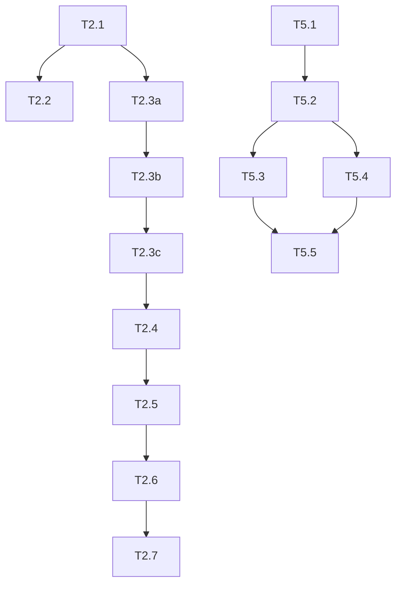

# YardFlow Master Sprint Plan

> **Generated:** January 27, 2026  
> **Status:** Revised (Subagent Review Incorporated)  
> **Methodology:** Atomic tasks → Demoable sprints → Validated builds  
> **Test Baseline:** 757 unit tests passing

---

## Project State Analysis

### What Exists (Verified ✅)

| Category | Status | Evidence |
|----------|--------|----------|
| **Core Site** | ✅ Running | 40 routes, homepage 7-step ladder, 757 unit tests |
| **Economics Engine** | ✅ LOCKED | `calcRoiV2` with golden tests, 6-component Variance Tax |
| **WebGL/Shaders** | ✅ Complete | BlackHole, ParticleNetwork, DissolveTransition |
| **Singularity Page** | ✅ Complete | Calculator → Shader binding, VarianceTaxDashboard |
| **Content Models** | ✅ Complete | ProofPoints, Sections, CoDevTracks, PhasedFramework (151 tests) |
| **Zustand Stores** | ✅ Complete | varianceTax, performance, persona |
| **E2E Tests** | ✅ 10 specs | routes, smoke, accessibility, visual-regression, network-map |
| **CI/CD** | ✅ Exists | `.github/workflows/ci.yml` - lint, typecheck, tests, build, Lighthouse |
| **NetworkMap** | ✅ Exists | 174-line component with tooltips, detail panel, connections |

### What Needs Enhancement

| Gap | Priority | Sprint |
|-----|----------|--------|
| CI missing shader validation | 🔥 Critical | S1 |
| CI missing artifact upload on failure | High | S1 |
| Route consolidation (dead pages) | High | S2 |
| Accessibility audit (WCAG 2.1 AA) | High | S3 |
| Lead capture enhancement | High | S4 |
| Network map shareable URLs | Medium | S5 |
| Documentation & onboarding | Medium | S6 |

---

## Sprint Overview

| Sprint | Focus | Tasks | Demo Output | Test Delta |
|--------|-------|-------|-------------|------------|
| **S1** | CI Enhancement | 5 | Shader validation, failure artifacts, full E2E | +5 tests |
| **S2** | Route Cleanup | 8 | Dead pages removed, sitemap clean, nav coherent | +10 tests |
| **S3** | Accessibility | 7 | WCAG 2.1 AA, screen reader tested | +20 tests |
| **S4** | Lead Capture | 6 | Enhanced forms, UTM tracking, branded PDFs | +15 tests |
| **S5** | Map Sharing | 5 | Shareable network configurations | +10 tests |
| **S6** | Docs & Hardening | 5 | Developer docs, runbook, ADRs | N/A |

---

## Sprint 1: CI Enhancement

**Goal:** Strengthen existing CI with missing validations.  
**Demo:** Push shader change → CI validates syntax. Test failure → Report uploaded.  
**Prerequisite:** Review existing `.github/workflows/ci.yml` (87 lines)

**Existing CI has:** lint, typecheck, unit tests, build, bundle audit, content audit, Playwright smoke, Lighthouse  
**Missing:** shader validation, Playwright report upload, all-browser E2E, congruence check

---

### T1.1: Add Shader Validation to CI

**Description:** Run `npm run test:shaders` in CI to catch GLSL syntax errors.

**File:** `.github/workflows/ci.yml`

**Implementation:**
```yaml
# Add after "Unit Tests" step
      - name: Shader Validation (GLSL syntax)
        run: npm run test:shaders
```

**Validation:**
- [ ] Push invalid shader → CI fails
- [ ] Push valid shader → CI passes

**Estimate:** 15m

---

### T1.2: Add Playwright Report Upload on Failure

**Description:** Upload Playwright HTML report when E2E tests fail.

**File:** `.github/workflows/ci.yml`

**Implementation:**
```yaml
# Add after E2E step
      - name: Upload Playwright Report
        if: failure()
        uses: actions/upload-artifact@v4
        with:
          name: playwright-report
          path: flow-state-site/playwright-report
          retention-days: 7
```

**Validation:**
- [ ] Failing E2E test → Report artifact available in Actions
- [ ] Passing E2E test → No artifact uploaded

**Estimate:** 15m

---

### T1.3: Add Congruence Check to CI

**Description:** Run pre-deployment validation in CI.

**File:** `.github/workflows/ci.yml`

**Implementation:**
```yaml
# Add after Content Audit step
      - name: Congruence Check
        run: npm run congruence:check
```

**Validation:**
- [ ] Congruence failures block merge
- [ ] All 22 checks pass in CI

**Estimate:** 15m

---

### T1.4: Expand E2E to All Browsers

**Description:** Current CI only runs Chromium. Add Firefox and WebKit.

**File:** `.github/workflows/ci.yml`

**Implementation:**
```yaml
# Change browser install line
      - name: Install Playwright browsers
        run: npx playwright install --with-deps chromium firefox webkit

# Ensure test:e2e:ci runs all projects
```

**Validation:**
- [ ] CI log shows 3 browsers tested
- [ ] All browsers pass E2E tests

**Estimate:** 30m

---

### T1.5: Add Build Artifact Upload

**Description:** Preserve build output for debugging.

**File:** `.github/workflows/ci.yml`

**Implementation:**
```yaml
# Add after Build step
      - name: Upload Build Artifact
        uses: actions/upload-artifact@v4
        with:
          name: nextjs-build
          path: flow-state-site/.next
          retention-days: 3
```

**Validation:**
- [ ] Build artifact available in Actions tab
- [ ] Artifact size < 100MB

**Estimate:** 15m

---

## Sprint 2: Route Architecture & Cleanup

**Goal:** Clean sitemap, remove dead pages, coherent navigation.  
**Demo:** Site has ~30 routes (down from 40), nav matches sitemap, no 404s internally.  
**Prerequisite:** Content models from S0 verified working (151 tests)

---

### T2.1: Route Audit Documentation

**Description:** Document all 40 routes, classify as keep/merge/delete.

**File:** `docs/ROUTE_AUDIT.md` (new)

**Implementation:**
Current routes (from `find app -name "page.tsx"`):
```
KEEP (Core funnel):
- /, /roi, /singularity, /contact, /product, /solutions/*, /proof, /resources/*

MERGE:
- /case-studies → /proof (case study is proof)
- /simulations, /resources/simulations → /singularity
- /start-your-map → /yardbuilder

DELETE (test/backup):
- /__test-error__, /icon-test, /logo-test, /test-canvas
- page-*.tsx backup files
```

**Validation:**
- [ ] ROUTE_AUDIT.md created with all 40 routes classified
- [ ] Each classification has rationale
- [ ] Team approves classifications

**Estimate:** 1h

**Blocker for:** T2.2, T2.3, T2.4, T2.5

---

### T2.2: Delete Test Pages

**Description:** Remove development-only pages.

**Files to delete:**
- `app/__test-error__/`
- `app/icon-test/`
- `app/logo-test/`
- `app/logo-preview/`
- `app/og-preview/`
- `app/test-canvas/`

**Blocked by:** T2.1

**Validation:**
- [ ] `npm run build` succeeds
- [ ] `npm run test:smoke` passes
- [ ] Sitemap excludes deleted routes

**Estimate:** 20m

---

### T2.3a: Migrate /case-studies Content to /proof

**Description:** Move case study content into /proof page.

**Files:**
- `app/proof/page.tsx` (modify - add case study sections)

**Blocked by:** T2.1

**Validation:**
- [ ] /proof contains case study content
- [ ] Content adapters (`getProofPoints()`) still work
- [ ] Unit tests pass

**Estimate:** 1h

---

### T2.3b: Add Redirects for Merged Routes

**Description:** Redirect old URLs to new destinations.

**Files:**
- `next.config.js` (add redirects)

**Blocked by:** T2.3a

**Implementation:**
```javascript
async redirects() {
  return [
    { source: '/case-studies', destination: '/proof', permanent: true },
    { source: '/case-studies/:slug', destination: '/proof', permanent: true },
    { source: '/simulations', destination: '/singularity', permanent: true },
    { source: '/resources/simulations', destination: '/singularity', permanent: true },
    { source: '/start-your-map', destination: '/yardbuilder', permanent: true },
  ];
}
```

**Validation:**
- [ ] `curl -I localhost:3000/case-studies` returns 308
- [ ] Redirect destination is correct

**Estimate:** 30m

---

### T2.3c: Update Internal Links

**Description:** Find and update all internal links to merged routes.

**Files:** Multiple (grep for old paths)

**Blocked by:** T2.3b

**Implementation:**
```bash
grep -r "case-studies\|simulations\|start-your-map" app/ components/ --include="*.tsx"
```

**Validation:**
- [ ] No internal links to old routes remain
- [ ] E2E smoke test passes

**Estimate:** 30m

---

### T2.4: Delete Merged Route Source Files

**Description:** Remove source files for merged routes.

**Files to delete:**
- `app/case-studies/` (after redirect works)
- `app/simulations/` 
- `app/resources/simulations/`
- `app/start-your-map/`

**Blocked by:** T2.3c

**Validation:**
- [ ] `npm run build` succeeds
- [ ] Redirects still work

**Estimate:** 15m

---

### T2.5: Update Navigation Menu

**Description:** Nav reflects cleaned-up sitemap.

**Files:**
- `components/Header.tsx` (modify)
- `config/navigation.ts` (new - centralize nav config)

**Blocked by:** T2.4

**Implementation:**
```typescript
// config/navigation.ts
export const NAV_ITEMS = [
  { label: 'Product', href: '/product' },
  { label: 'Solutions', href: '/solutions' },
  { label: 'Proof', href: '/proof' },
  { label: 'ROI', href: '/roi' },
  { label: 'Resources', href: '/resources' },
] as const;
```

**Validation:**
- [ ] Nav matches sitemap
- [ ] Mobile nav works
- [ ] Keyboard navigation works (Tab through links)

**Estimate:** 45m

---

### T2.6: Update Sitemap Generator

**Description:** sitemap.ts reflects actual routes.

**File:** `app/sitemap.ts`

**Blocked by:** T2.5

**Validation:**
- [ ] `curl localhost:3000/sitemap.xml` shows only valid routes
- [ ] No 404s when crawling sitemap
- [ ] changefreq/priority set appropriately

**Estimate:** 30m

---

### T2.7: Update E2E Route Tests

**Description:** E2E tests reflect new route structure.

**Files:**
- `e2e/routes.spec.ts`
- `e2e/smoke.spec.ts`

**Blocked by:** T2.6

**Validation:**
- [ ] `npm run test:smoke` passes
- [ ] All routes in test file exist
- [ ] Redirect assertions added for merged routes

**Estimate:** 30m

---

## Sprint 3: Accessibility (WCAG 2.1 AA)

**Goal:** Full WCAG 2.1 AA compliance, tested with screen reader.  
**Demo:** Run axe-core → 0 critical/serious issues. Navigate site with keyboard only.

---

### T3.1: Baseline Accessibility Audit

**Description:** Run axe-core, document all violations.

**Files:**
- `docs/A11Y_AUDIT.md` (new)
- `e2e/accessibility.spec.ts` (verify coverage)

**Implementation:**
```bash
npm run test:e2e -- e2e/accessibility.spec.ts
```

**Validation:**
- [ ] A11Y_AUDIT.md lists all current violations
- [ ] Violations categorized: critical/serious/moderate/minor
- [ ] Baseline count documented

**Estimate:** 1h

---

### T3.2: Fix Color Contrast Issues

**Description:** Ensure all text meets 4.5:1 contrast ratio.

**Files:**
- `tailwind.config.js`
- Components using `text-steel` on dark backgrounds

**Implementation:**
Current `steel` (#8892A8) on `void` (#232A35) = ~4.2:1 (fails AA)
- Option A: Lighten steel to `#A5ADBD` (steel-light)
- Option B: Add utility class `text-steel-accessible`

**Validation:**
- [ ] axe-core reports 0 color contrast violations
- [ ] WebAIM checker: all text/background pairs pass 4.5:1

**Estimate:** 1.5h

---

### T3.3: Add Skip-to-Content Link

**Description:** Allow keyboard users to skip navigation.

**Files:**
- `app/layout.tsx`

**Implementation:**
```tsx
<a 
  href="#main-content" 
  className="sr-only focus:not-sr-only focus:absolute focus:z-50 focus:p-4 focus:bg-void focus:text-neon focus:top-4 focus:left-4 focus:rounded"
>
  Skip to main content
</a>
```

Note: `#main-content` exists on homepage (line 58 of page.tsx)

**Validation:**
- [ ] Tab from page load → skip link visible
- [ ] Enter on skip link → focus moves to main content

**Estimate:** 30m

---

### T3.4: Fix Focus Indicators

**Description:** Visible focus on all interactive elements.

**Files:**
- `styles/globals.css` or `app/globals.css`
- `components/Button.tsx` (verify)

**Implementation:**
```css
*:focus-visible {
  outline: 2px solid #05ACEB;
  outline-offset: 2px;
}
```

**Validation:**
- [ ] Tab through all pages → focus always visible
- [ ] Focus ring is brand color (flow/cerulean)

**Estimate:** 45m

---

### T3.5: Add ARIA Labels to Icon Buttons

**Description:** Icon-only buttons need accessible names.

**Files:**
- `components/Header.tsx` (mobile menu)
- `components/Footer.tsx` (social icons)
- `components/ThemeToggle.tsx`

**Implementation:**
```tsx
<button aria-label="Open navigation menu">
  <MenuIcon aria-hidden="true" />
</button>
```

**Validation:**
- [ ] VoiceOver/NVDA announces button purpose
- [ ] No "button" without accessible name

**Estimate:** 1h

---

### T3.6: Fix Form Accessibility

**Description:** Forms have proper labels, error associations.

**Files:**
- `components/LeadForm.tsx`
- `components/ui/IndustrialInputs.tsx`

**Implementation:**
- Add `aria-describedby` for error messages
- Add `aria-required="true"` for required fields
- Ensure labels have `htmlFor` matching input `id`

**Validation:**
- [ ] Screen reader announces field label when focused
- [ ] Error message announced when field invalid
- [ ] Required fields clearly indicated

**Estimate:** 1.5h

---

### T3.7: Keyboard Navigation E2E Test

**Description:** Verify full keyboard navigability.

**File:** `e2e/accessibility.spec.ts` (extend)

**Implementation:**
```typescript
test('full keyboard navigation - homepage', async ({ page }) => {
  await page.goto('/');
  
  // Tab through page, verify focus never gets stuck
  let lastFocused = '';
  for (let i = 0; i < 100; i++) {
    await page.keyboard.press('Tab');
    const focused = await page.evaluate(() => 
      document.activeElement?.getAttribute('aria-label') || 
      document.activeElement?.textContent?.slice(0, 20)
    );
    if (focused === lastFocused && i > 5) break; // Detect focus trap
    lastFocused = focused || '';
  }
  
  // Verify skip link works
  await page.goto('/');
  await page.keyboard.press('Tab');
  await expect(page.locator(':focus')).toContainText('Skip');
});
```

**Validation:**
- [ ] E2E keyboard test passes
- [ ] Focus never trapped or lost
- [ ] Tab order is logical

**Estimate:** 1h

---

## Sprint 4: Lead Capture Enhancement

**Goal:** Better lead qualification, UTM tracking, professional collateral.  
**Demo:** Submit form with UTM → see in webhook → export branded PDF.

---

### T4.1: Add Qualification Fields to LeadForm

**Description:** Company size, facilities count for lead scoring.

**File:** `components/LeadForm.tsx`

**Existing fields:** name, email, company, phone, message, interest

**New fields:**
```typescript
companySize: '1-10' | '11-50' | '51-200' | '200+';
facilitiesCount: '1-5' | '6-20' | '21-50' | '50+';
```

**Validation:**
- [ ] Vitest: LeadForm renders new dropdowns
- [ ] E2E: Form submits with qualification data
- [ ] API: Webhook receives new fields

**Estimate:** 1.5h

---

### T4.2: Implement UTM Capture

**Description:** Capture UTM params on first visit, persist, include in submissions.

**File:** `lib/utm.ts` (exists - verify implementation)

**Implementation:**
```typescript
// On first visit
export function captureUtmParams(): void {
  if (typeof window === 'undefined') return;
  const params = new URLSearchParams(window.location.search);
  const utm = {
    source: params.get('utm_source'),
    medium: params.get('utm_medium'),
    campaign: params.get('utm_campaign'),
  };
  if (Object.values(utm).some(Boolean)) {
    sessionStorage.setItem('yardflow_utm', JSON.stringify(utm));
  }
}

export function getStoredUtm(): UtmParams | null {
  if (typeof window === 'undefined') return null;
  const stored = sessionStorage.getItem('yardflow_utm');
  return stored ? JSON.parse(stored) : null;
}
```

**Validation:**
- [ ] Vitest: captureUtmParams extracts from URL
- [ ] Vitest: getStoredUtm retrieves persisted values
- [ ] E2E: Visit with UTM → Submit form → UTM in payload

**Estimate:** 1h

---

### T4.3: Enhance ROI PDF Branding

**Description:** Professional header with logo, company name, date.

**File:** `src/lib/pdf/roiPdf.tsx`

**Implementation:**
- Header: YardFlow logo (SVG from branding.ts), company name, date
- Assumptions section: All input values listed
- Footer: Contact email, disclaimer

**Validation:**
- [ ] Vitest: PDF string contains company name
- [ ] Vitest: PDF string contains generation date
- [ ] Manual: PDF opens correctly, looks professional

**Estimate:** 1.5h

---

### T4.4: Industry-Specific ROI Presets

**Description:** Quick presets for Retail, 3PL, Manufacturing.

**Files:**
- `src/lib/economics/presets.ts` (extend if exists)
- `app/roi/page.tsx` (add industry selector)

**Implementation:**
```typescript
export const INDUSTRY_PRESETS = {
  retail: { name: 'Retail', laborReduction: 70, dwellReduction: 24 },
  '3pl': { name: '3PL', laborReduction: 65, dwellReduction: 30 },
  manufacturing: { name: 'Manufacturing', laborReduction: 60, dwellReduction: 20 },
};
```

**Validation:**
- [ ] Vitest: Each preset loads correct values
- [ ] E2E: Industry dropdown changes calculator inputs

**Estimate:** 1.5h

---

### T4.5: Email Template Enhancement

**Description:** HTML email with qualification data and UTM source.

**File:** `src/lib/email.ts`

**Implementation:**
- Include all form fields in readable format
- Add UTM source/medium/campaign if present
- Clean HTML template with inline styles

**Validation:**
- [ ] Vitest: Email contains all fields
- [ ] Manual: Email renders correctly in Gmail

**Estimate:** 1h

---

### T4.6: Lead Form E2E Enhancement

**Description:** Comprehensive E2E test for qualification flow.

**File:** `e2e/lead-form.spec.ts` (extend)

**Implementation:**
```typescript
test('qualification form with UTM tracking', async ({ page }) => {
  // Visit with UTM params
  await page.goto('/contact?utm_source=test&utm_campaign=demo');
  
  // Fill qualification fields
  await page.selectOption('[name="companySize"]', '51-200');
  await page.selectOption('[name="facilitiesCount"]', '21-50');
  
  // ... rest of form, submit, verify
});
```

**Validation:**
- [ ] E2E test covers full qualification flow
- [ ] Test covers UTM persistence
- [ ] Test covers error states

**Estimate:** 1h

---

## Sprint 5: Network Map Sharing

**Goal:** Shareable network configurations via URL.  
**Demo:** Build network → Copy URL → Share → Recipient sees same config.  
**Prerequisite:** NetworkMap component exists (174 lines, 6 files)

**Existing NetworkMap has:** FacilityNode, Connections, Tooltip, DetailPanel, 142-line E2E test

---

### T5.1: Network Configuration Store

**Description:** Zustand store for network state.

**File:** `src/lib/stores/networkStore.ts` (new)

**Implementation:**
```typescript
interface NetworkState {
  facilities: Facility[];
  connections: Connection[];
  selectedId: string | null;
  addFacility: (f: Omit<Facility, 'id'>) => void;
  removeFacility: (id: string) => void;
  setSelected: (id: string | null) => void;
  clear: () => void;
  loadFromConfig: (config: NetworkConfig) => void;
}

export const useNetworkStore = create<NetworkState>()(
  persist(
    (set) => ({
      facilities: [],
      connections: [],
      selectedId: null,
      // ... actions
    }),
    { name: 'yardflow-network' }
  )
);
```

**Validation:**
- [ ] Vitest: CRUD operations work
- [ ] Vitest: State persists to localStorage

**Estimate:** 1.5h

---

### T5.2: URL State Encoding

**Description:** Encode/decode network config in URL.

**File:** `lib/hooks/useNetworkUrlState.ts` (new)

**Implementation:**
```typescript
// Encode: facilities in URL hash
// #config=base64(JSON.stringify({ facilities, connections }))

export function encodeNetworkUrl(config: NetworkConfig): string {
  const json = JSON.stringify(config);
  const base64 = btoa(json);
  return `${window.location.origin}/demo/network-map#config=${base64}`;
}

export function decodeNetworkUrl(hash: string): NetworkConfig | null {
  const match = hash.match(/config=([A-Za-z0-9+/=]+)/);
  if (!match) return null;
  try {
    return JSON.parse(atob(match[1]));
  } catch {
    return null;
  }
}
```

**Validation:**
- [ ] Vitest: Encode → Decode returns same config
- [ ] Vitest: Invalid hash returns null

**Estimate:** 1h

---

### T5.3: Share Button Component

**Description:** Copy shareable URL to clipboard.

**File:** `components/NetworkMap/ShareButton.tsx` (new)

**Implementation:**
```tsx
export function ShareButton({ config }: { config: NetworkConfig }) {
  const [copied, setCopied] = useState(false);
  
  const handleShare = async () => {
    const url = encodeNetworkUrl(config);
    await navigator.clipboard.writeText(url);
    setCopied(true);
    setTimeout(() => setCopied(false), 2000);
  };
  
  return (
    <Button onClick={handleShare} variant="secondary">
      {copied ? 'Copied!' : 'Share Network'}
    </Button>
  );
}
```

**Validation:**
- [ ] Vitest: Button renders
- [ ] E2E: Click button → URL in clipboard

**Estimate:** 1h

---

### T5.4: Load Config from URL

**Description:** On page load, restore config from URL hash.

**File:** `app/demo/network-map/page.tsx` (modify)

**Implementation:**
```typescript
useEffect(() => {
  const config = decodeNetworkUrl(window.location.hash);
  if (config) {
    useNetworkStore.getState().loadFromConfig(config);
  }
}, []);
```

**Validation:**
- [ ] E2E: Open shared URL → Same network displayed
- [ ] E2E: Invalid hash → Empty network (no crash)

**Estimate:** 45m

---

### T5.5: Sharing E2E Tests

**Description:** Test full share flow.

**File:** `e2e/network-map.spec.ts` (extend)

**Implementation:**
```typescript
test('share and load network configuration', async ({ page, context }) => {
  await page.goto('/demo/network-map');
  
  // Add facility (click on map)
  // Click share button
  // Get clipboard content
  // Open new page with shared URL
  // Verify same facilities displayed
});
```

**Validation:**
- [ ] E2E test passes
- [ ] Share → Load flow works end-to-end

**Estimate:** 1h

---

## Sprint 6: Documentation & Hardening

**Goal:** Complete developer documentation, production runbook.  
**Demo:** New developer follows guide → Environment running in 10 minutes.

---

### T6.1a: Update README

**Description:** Clear quick-start guide.

**File:** `flow-state-site/README.md`

**Implementation:**
- Prerequisites (Node 20+, npm 10+)
- Clone → Install → Run (3 commands)
- Key commands table
- Link to detailed docs

**Validation:**
- [ ] New developer follows README successfully
- [ ] All commands in README work

**Estimate:** 1h

---

### T6.1b: Developer Guide

**Description:** Comprehensive onboarding document.

**File:** `docs/DEVELOPER_GUIDE.md` (new)

**Implementation:**
- Environment setup (VS Code extensions, settings)
- Project structure overview
- Common tasks (add page, add component, modify economics)
- Debugging tips
- Testing strategy

**Validation:**
- [ ] Guide covers common scenarios
- [ ] Links to relevant files correct

**Estimate:** 1.5h

---

### T6.2: Environment Variable Documentation

**Description:** Complete env var reference.

**Files:**
- `flow-state-site/.env.example` (update)
- `docs/ENV_VARS.md` (new)

**Implementation:**
- All variables documented
- Required vs optional marked
- Default values noted
- Service setup links

**Validation:**
- [ ] All env vars from codebase in docs
- [ ] Production checklist matches

**Estimate:** 1h

---

### T6.3: Production Runbook

**Description:** Operational procedures.

**File:** `docs/RUNBOOK.md` (new)

**Implementation:**
- Deployment process (Vercel)
- Rollback procedure
- Monitoring (Sentry, Vercel analytics)
- Incident response
- Common issues and fixes

**Validation:**
- [ ] Runbook covers deployment
- [ ] Procedures are accurate

**Estimate:** 1.5h

---

### T6.4: Architecture Decision Records

**Description:** Document key decisions.

**Files:**
- `docs/adr/001-economics-locking.md`
- `docs/adr/002-zustand-stores.md`
- `docs/adr/003-shader-system.md`

**Implementation:**
ADR template:
- Context: What prompted the decision
- Decision: What was decided
- Consequences: Trade-offs and implications

**Validation:**
- [ ] Each ADR follows template
- [ ] Key decisions covered

**Estimate:** 2h

---

## Sprint Completion Checklist

**After each sprint:**
1. [ ] `npm run precommit` passes
2. [ ] `npm run predeploy` passes (if CI enhanced)
3. [ ] All sprint tasks marked complete
4. [ ] Test count verified: baseline + delta
5. [ ] No new TypeScript errors
6. [ ] No new Lighthouse regressions
7. [ ] Demo completed to stakeholder

---

## Appendix: Task Dependencies



---

## Appendix: File Existence Matrix

| File | Exists | Sprint | Action |
|------|--------|--------|--------|
| `.github/workflows/ci.yml` | ✅ Yes | S1 | Modify |
| `docs/ROUTE_AUDIT.md` | ❌ No | S2 | Create |
| `config/navigation.ts` | ❌ No | S2 | Create |
| `docs/A11Y_AUDIT.md` | ❌ No | S3 | Create |
| `lib/utm.ts` | ✅ Yes | S4 | Verify/Modify |
| `src/lib/stores/networkStore.ts` | ❌ No | S5 | Create |
| `docs/DEVELOPER_GUIDE.md` | ❌ No | S6 | Create |
| `docs/adr/` | ❌ No | S6 | Create |

---

**Last Updated:** January 27, 2026  
**Review Status:** Subagent reviewed, feedback incorporated  
**Ready for Execution:** ✅
