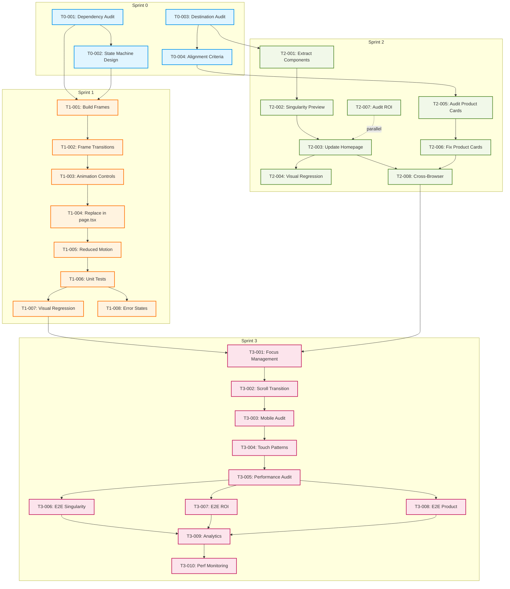

# Sprint Plan: Homepage Animation Flow & Card Aesthetic Alignment

**Created:** January 21, 2026  
**Owner:** Engineering Team  
**Status:** Ready for Execution

---

## Executive Summary

### Problem Statement
1. **Animation Redundancy:** Homepage shows `DigitalGuardAnimation`, then immediately displays "Digital Guard" again as the first of four module cards - creating visual redundancy and weakening the narrative flow
2. **Card Aesthetic Mismatch:** Singularity card uses generic network SVG that doesn't match the actual 32-node map visualization on the `/singularity` destination page
3. **Expectation Disconnect:** Cards should visually preview their destination pages to set accurate user expectations

### Success Criteria
- ✅ Zero redundant Digital Guard presentations in homepage flow
- ✅ Singularity card aesthetic matches destination page (32-node map style)
- ✅ All homepage cards align with destination page aesthetics (visual rubric)
- ✅ Lighthouse performance score ≥90 maintained
- ✅ Zero accessibility regressions
- ✅ Measurable improvement in Singularity card CTR (baseline: TBD)

### Approach
- **3 Sprints** with clear demoable outcomes
- **Parallel execution** where possible (Animation track + Card audit track)
- **Atomic tasks** with explicit validation criteria
- **Test-driven** with visual regression, E2E, and accessibility coverage

---

## Sprint 0: Setup & Research
**Duration:** 2-3 days  
**Goal:** Establish foundation for animation and card work  
**Demoable Outcome:** Documented design specs, baselines, and dependency map

### T0-001: Dependency Audit & Brand Timing Verification
**Owner:** Engineering  
**Effort:** 2 hours

**Description:**
- Check if `ProtocolSequenceAnimation` needs new animation primitives/utilities
- Verify brand timing constants exist in `config/brand.ts` or `lib/motion-presets.ts`
- Identify reusable components from existing animations:
  - `DigitalGuardAnimation.tsx`
  - `YardChaosAnimation.tsx`
  - `ChainOfCustodyAnimation.tsx`
  - `ProtocolRollupAnimation.tsx`
- Document animation library usage (framer-motion)

**Validation:**
- [ ] `DEPENDENCIES.md` created with component inventory
- [ ] Brand timing values confirmed (stagger delays, transition durations)
- [ ] Reusable primitives identified (shared hooks, motion variants)

**Files Modified:** None (research only)

---

### T0-002: Animation State Machine Design
**Owner:** Design + Engineering  
**Effort:** 3 hours

**Description:**
- Design state transitions: `Guard → Comms → BOL → YMS → [loop|rest]`
- Define timing constants:
  - Display duration per module: **3 seconds** (proposed)
  - Transition duration: **500ms fade** (proposed)
  - Total cycle time: **~15 seconds** (proposed)
- Sketch visual transition logic:
  - Option A: Cross-fade with subtle scale
  - Option B: Slide transition with motion blur
  - Option C: Morphing icon with color shift
- Document reduced-motion alternative (static 4-module grid)
- Add state diagram (Mermaid or Figma)

**Validation:**
- [ ] `ANIMATION_STATE_MACHINE.md` created with:
  - State diagram (visual)
  - Timing specification table
  - Transition type decision (A/B/C)
  - Reduced-motion fallback spec
- [ ] Design approved by product owner

**Files Modified:** None (design only)

---

### T0-003: Destination Page Aesthetic Audit
**Owner:** Design + QA  
**Effort:** 4 hours  
**Can run in parallel with T0-001, T0-002**

**Description:**
- Use automated screenshot tool (Playwright) for consistency
- Capture destination pages:
  - `/singularity` (target: 32-node map visualization)
  - `/roi` (target: calculator grid)
  - `/product` (target: module detail pages)
  - `/network-effect` (if linked from homepage)
- Extract visual characteristics:
  - **Color palette:** Primary/accent/background hex codes
  - **Key elements:** SVG patterns, animation types, layout grid
  - **Typography:** Heading styles, monospace usage
  - **Iconography:** Style (line/filled), size, spacing

**Validation:**
- [ ] `CARD_AESTHETIC_AUDIT.md` created with:
  - Screenshots for each destination (desktop + mobile)
  - Color palette swatches (hex codes)
  - Visual element inventory (SVGs, animations, layouts)
  - Typography spec (font-size, weight, family)
- [ ] Audit reviewed by design team

**Commands:**
```bash
# Capture screenshots with Playwright
npx playwright test scripts/capture-destination-screenshots.spec.ts

# Extract color palette with automated tool
npx node scripts/extract-page-palette.js /singularity
```

**Files Created:**
- `docs/CARD_AESTHETIC_AUDIT.md`
- `screenshots/destination-pages/*.png`

---

### T0-004: Define Card Alignment Criteria
**Owner:** Product + Design  
**Effort:** 2 hours  
**Depends on:** T0-003

**Description:**
- What constitutes "matches destination aesthetic"?
- Create visual alignment rubric:
  - **Level 1 (Critical):** Color palette matches (primary, accent)
  - **Level 2 (High):** Icon/graphic style matches (line vs. filled, animation)
  - **Level 3 (Medium):** Layout pattern evokes destination (grid, list, map)
  - **Level 4 (Nice-to-have):** Typography style matches
- Document acceptable variance:
  - 100% pixel-perfect? (NO - unrealistic for card preview)
  - "Evokes same feeling"? (YES - color + key visual element sufficient)
- Create examples:
  - ✅ Good: ROI card shows calculator grid (matches destination)
  - ❌ Bad: Singularity card shows generic network (doesn't match 32-node map)

**Validation:**
- [ ] `CARD_ALIGNMENT_RUBRIC.md` created with:
  - 4-level rubric (Critical → Nice-to-have)
  - Variance tolerance definition
  - ✅/❌ examples with screenshots
- [ ] Rubric approved by product + design

**Files Created:**
- `docs/CARD_ALIGNMENT_RUBRIC.md`

---

## Sprint 1: Animation Implementation
**Duration:** 5-7 days  
**Goal:** Replace `DigitalGuardAnimation` with `ProtocolSequenceAnimation` showing all 4 modules  
**Demoable Outcome:** Homepage animation cycles through all modules without redundancy

### T1-001: Build Static Frames for 4 Modules
**Owner:** Engineering  
**Effort:** 6 hours  
**Depends on:** T0-002 (state machine design)

**Description:**
- Create 4 static SVG/React frames:
  1. **Digital Guard:** Shield icon + "Automated Verification" text
  2. **Digital Comms:** Chat bubble icon + "Two-way Messaging" text
  3. **Digital BOL:** Document icon + "Touchless Documentation" text
  4. **Digital YMS:** Dashboard icon + "Real-time Visualization" text
- Use brand colors (neon `#D91411`, flow `#05ACEB`, void `#232A35`)
- Ensure icons match `components/icons/FlowIcons.tsx` (Shield, Velocity, Manifest, Metrics)
- Make frames responsive (scale for mobile/tablet/desktop)

**Validation:**
- [ ] 4 frame components created in `components/animations/frames/`
- [ ] Each frame renders independently (Storybook or component test)
- [ ] Icons match FlowIcons style guide
- [ ] Responsive scaling works (test at 375px, 768px, 1280px)

**Commands:**
```bash
# Run component in isolation
npm run dev
# Navigate to http://localhost:3000/test-canvas

# Run visual regression
npm run test:visual -- --update-snapshots
```

**Files Created:**
- `components/animations/frames/GuardFrame.tsx`
- `components/animations/frames/CommsFrame.tsx`
- `components/animations/frames/BolFrame.tsx`
- `components/animations/frames/YmsFrame.tsx`

**Files Modified:**
- `components/animations/index.ts` (export frames)

---

### T1-002: Implement Frame Transitions
**Owner:** Engineering  
**Effort:** 8 hours  
**Depends on:** T1-001

**Description:**
- Build `ProtocolSequenceAnimation` component
- Use framer-motion `<AnimatePresence>` for transitions
- Implement state progression:
  ```typescript
  const [currentModule, setCurrentModule] = useState(0); // 0=Guard, 1=Comms, 2=BOL, 3=YMS
  
  useEffect(() => {
    const timer = setInterval(() => {
      setCurrentModule((prev) => (prev + 1) % 4);
    }, 3000); // 3 seconds per module
    return () => clearInterval(timer);
  }, []);
  ```
- Add transition variants from `lib/motion-presets.ts` or create custom:
  ```typescript
  const frameVariants = {
    enter: { opacity: 0, scale: 0.95 },
    center: { opacity: 1, scale: 1 },
    exit: { opacity: 0, scale: 1.05 },
  };
  ```
- Respect brand timing (500ms transition duration)

**Validation:**
- [ ] Animation cycles through all 4 modules
- [ ] Transition duration matches brand spec (500ms)
- [ ] No flickering or layout shift during transitions
- [ ] Smooth 60fps animation (Chrome DevTools Performance)

**Commands:**
```bash
# Run dev server with FPS monitor
npm run dev
# Open Chrome DevTools → Performance → Record

# Run animation tests
npm run test:unit -- ProtocolSequenceAnimation
```

**Files Created:**
- `components/animations/ProtocolSequenceAnimation.tsx`

**Files Modified:**
- `components/animations/index.ts` (export new animation)

---

### T1-003: Add Animation Controls & Brand Timing
**Owner:** Engineering  
**Effort:** 4 hours  
**Depends on:** T1-002

**Description:**
- Add play/pause controls (for accessibility)
- Add loop behavior:
  - **Option A:** Infinite loop (auto-play forever)
  - **Option B:** Play once, then rest (accessibility-friendly)
  - **Decision:** Use Option B with play button for manual restart
- Integrate brand timing constants from `config/brand.ts`:
  ```typescript
  import { ANIMATION_TIMING } from '@/config/brand';
  const DISPLAY_DURATION = ANIMATION_TIMING.moduleDisplay || 3000;
  const TRANSITION_DURATION = ANIMATION_TIMING.transition || 500;
  ```
- Add `aria-live="polite"` region for screen reader announcements
- Announce current module: "Now showing: Digital Guard"

**Validation:**
- [ ] Pause button stops animation
- [ ] Play button resumes animation
- [ ] Loop behavior matches decision (once + manual restart)
- [ ] Brand timing constants used (no magic numbers)
- [ ] Screen reader announces module changes

**Commands:**
```bash
# Test with screen reader (macOS VoiceOver)
# Cmd+F5 to enable, interact with animation

# Test with keyboard only
# Tab to controls, Space/Enter to activate
```

**Files Modified:**
- `components/animations/ProtocolSequenceAnimation.tsx`
- `config/brand.ts` (add ANIMATION_TIMING if missing)

---

### T1-004: Replace DigitalGuardAnimation in page.tsx
**Owner:** Engineering  
**Effort:** 2 hours  
**Depends on:** T1-003

**Description:**
- Update `app/page.tsx` line ~178:
  ```diff
  - <DigitalGuardAnimation />
  + <ProtocolSequenceAnimation />
  ```
- Update import statement:
  ```diff
  - import { DigitalGuardAnimation, ... } from '@/components/animations';
  + import { ProtocolSequenceAnimation, ... } from '@/components/animations';
  ```
- Verify four module cards (lines 181-247) still render below animation
- Ensure no visual duplication:
  - Animation shows Digital Guard (frame 1 of 4)
  - Module cards show all 4 modules (no redundancy issue)
  - **Key difference:** Animation is cyclic demo, cards are navigation links

**Validation:**
- [ ] Homepage loads with new animation
- [ ] Four module cards render below animation (no removal)
- [ ] No "Digital Guard appears twice" perception
- [ ] Build succeeds: `npm run build`
- [ ] TypeScript check passes: `npm run typecheck`

**Commands:**
```bash
npm run dev
# Navigate to http://localhost:3000
# Visual verification: animation cycles, cards below

npm run build && npm run typecheck
```

**Files Modified:**
- `app/page.tsx` (line ~37 import, line ~178 component usage)

---

### T1-005: Add Accessibility Features (Reduced Motion)
**Owner:** Engineering  
**Effort:** 3 hours  
**Depends on:** T1-004

**Description:**
- Detect `prefers-reduced-motion` media query
- Use existing `useReducedMotion()` hook from `src/lib/hooks/useReducedMotion.ts`
- Provide static fallback when reduced motion is enabled:
  ```typescript
  const shouldReduceMotion = useReducedMotion();
  
  if (shouldReduceMotion) {
    return <StaticProtocolGrid />; // Show all 4 modules in grid
  }
  
  return <ProtocolSequenceAnimation />;
  ```
- Create `StaticProtocolGrid` component:
  - 2×2 grid on desktop
  - 1×4 stacked on mobile
  - Same visual style as animation frames
- Ensure WCAG 2.2.2 compliance (Pause, Stop, Hide):
  - Animation pauses after first cycle (already in T1-003)
  - User can dismiss animation (add "Skip animation" button)

**Validation:**
- [ ] `prefers-reduced-motion: reduce` shows static grid
- [ ] Static grid visually matches animation frames
- [ ] "Skip animation" button works (hides animation, scrolls to cards)
- [ ] WCAG 2.2.2 Level AA compliance verified

**Commands:**
```bash
# Test reduced motion in Chrome DevTools
# Cmd+Shift+P → "Show Rendering" → Check "Emulate CSS prefers-reduced-motion"

# Run accessibility audit
npm run test:a11y
```

**Files Created:**
- `components/animations/StaticProtocolGrid.tsx`

**Files Modified:**
- `components/animations/ProtocolSequenceAnimation.tsx`

---

### T1-006: Unit Tests for Animation Logic
**Owner:** Engineering  
**Effort:** 4 hours  
**Depends on:** T1-005

**Description:**
- Test state transitions:
  ```typescript
  it('should cycle through modules in sequence', () => {
    render(<ProtocolSequenceAnimation />);
    expect(screen.getByText(/Digital Guard/i)).toBeInTheDocument();
    
    act(() => jest.advanceTimersByTime(3000));
    expect(screen.getByText(/Digital Comms/i)).toBeInTheDocument();
    
    act(() => jest.advanceTimersByTime(3000));
    expect(screen.getByText(/Digital BOL/i)).toBeInTheDocument();
    
    // ... etc
  });
  ```
- Test play/pause controls
- Test loop behavior (plays once, then stops)
- Test reduced motion fallback
- Target: **15+ assertions** covering core logic

**Validation:**
- [ ] All tests pass: `npm run test:unit -- ProtocolSequenceAnimation`
- [ ] Code coverage ≥80% for animation logic
- [ ] Tests run in <5 seconds

**Commands:**
```bash
npm run test:unit -- ProtocolSequenceAnimation.test.tsx
npm run test:unit -- --coverage
```

**Files Created:**
- `components/animations/__tests__/ProtocolSequenceAnimation.test.tsx`

---

### T1-007: Visual Regression Baseline
**Owner:** QA  
**Effort:** 3 hours  
**Depends on:** T1-006

**Description:**
- Set up visual regression tool (Percy, Chromatic, or Playwright)
- Capture baselines for:
  - Animation frame 1 (Guard)
  - Animation frame 2 (Comms)
  - Animation frame 3 (BOL)
  - Animation frame 4 (YMS)
  - Static grid (reduced motion)
- Capture at 3 viewport sizes:
  - Mobile: 375×667
  - Tablet: 768×1024
  - Desktop: 1280×800
- Store baselines in version control or cloud service

**Validation:**
- [ ] 5 frames × 3 viewports = **15 baseline screenshots** captured
- [ ] Visual regression tests pass on re-run (no changes)
- [ ] Baseline images reviewed and approved

**Commands:**
```bash
# Using Playwright for visual regression
npx playwright test e2e/animation-visual-regression.spec.ts --update-snapshots

# Using Percy (if available)
npx percy snapshot e2e/animation-snapshots.yml
```

**Files Created:**
- `e2e/animation-visual-regression.spec.ts`
- `e2e/__screenshots__/protocol-animation/*.png` (15 images)

---

### T1-008: Animation Error State Tests
**Owner:** Engineering  
**Effort:** 2 hours  
**Depends on:** T1-006

**Description:**
- Test failure scenarios:
  - Animation component fails to mount
  - Framer-motion library fails to load
  - Timer/interval conflicts with other page scripts
- Provide graceful fallbacks:
  ```typescript
  try {
    return <ProtocolSequenceAnimation />;
  } catch (error) {
    console.error('Animation failed:', error);
    return <StaticProtocolGrid />; // Fallback to static
  }
  ```
- Test error boundary integration
- Add Sentry/error logging

**Validation:**
- [ ] Error boundary catches animation failures
- [ ] Static fallback renders when animation fails
- [ ] Error logged to console/Sentry
- [ ] User experience unaffected (no blank screen)

**Commands:**
```bash
# Simulate error by breaking framer-motion import
npm run test:unit -- ProtocolSequenceAnimation.test.tsx
```

**Files Modified:**
- `components/animations/ProtocolSequenceAnimation.tsx`

---

## Sprint 2: Card Aesthetic Alignment
**Duration:** 5-7 days  
**Goal:** Align homepage card visuals with destination page aesthetics  
**Demoable Outcome:** Singularity card matches 32-node map style; all cards audited

### T2-001: Extract Singularity Visual Components & Set Budget
**Owner:** Engineering  
**Effort:** 4 hours  
**Depends on:** T0-003 (destination audit)

**Description:**
- Investigate `/singularity` page implementation:
  - File: `app/singularity/page.tsx`
  - Uses WebGL/Three.js for 32-node network visualization?
  - Or uses SVG-based animation?
- Determine preview approach:
  - **Option A:** Simplified SVG mimicking 32-node layout (recommended)
  - **Option B:** Actual WebGL component (heavy bundle size)
  - **Option C:** Static screenshot as image (fast but not interactive)
- Set bundle size budget for preview:
  - Target: **<50KB** for preview component
  - Rationale: Homepage should load fast, animation is secondary
- Document decision and rationale

**Validation:**
- [ ] Singularity page implementation documented
- [ ] Preview approach selected (A/B/C)
- [ ] Bundle size budget set and justified
- [ ] Decision reviewed by tech lead

**Commands:**
```bash
# Analyze current bundle size
npm run build
npx next-bundle-analyzer

# Check singularity page dependencies
grep -r "three" app/singularity/
grep -r "webgl" app/singularity/
```

**Files Created:**
- `docs/SINGULARITY_PREVIEW_DECISION.md`

---

### T2-002: Create SingularityPreviewCard Component
**Owner:** Engineering  
**Effort:** 8 hours  
**Depends on:** T2-001

**Description:**
- Build lightweight preview component based on T2-001 decision
- If using **SVG approach** (recommended):
  - Extract 32-node layout from singularity page
  - Create simplified SVG with:
    - 32 nodes (circles, r="2-4")
    - Connection lines (stroke="#00B4FF", opacity="0.5")
    - Pulsing animation (subtle, respects reduced motion)
  - Match color palette:
    - Primary: `#00B4FF` (flow)
    - Background: `#232A35` (void)
    - Accent: `#D91411` (neon)
- If using **WebGL approach** (not recommended):
  - Lazy load component with `React.lazy()` + `<Suspense>`
  - Add loading skeleton
  - Ensure bundle size <50KB
- Make component responsive (scale for mobile)
- Add hover effect (nodes pulse faster, connections brighten)

**Validation:**
- [ ] Component renders 32-node layout
- [ ] Color palette matches destination page (audit from T0-003)
- [ ] Bundle impact measured: `<50KB` (run bundle analyzer)
- [ ] Hover effect smooth (60fps)
- [ ] Responsive scaling works (375px, 768px, 1280px)

**Commands:**
```bash
# Build and measure bundle size
npm run build
npx next-bundle-analyzer

# Check component size in isolation
npx size-limit
```

**Files Created:**
- `components/cards/SingularityPreviewCard.tsx`
- `components/cards/__tests__/SingularityPreviewCard.test.tsx`

**Files Modified:**
- `components/cards/index.ts` (export)

---

### T2-003: Update Homepage Singularity Card
**Owner:** Engineering  
**Effort:** 3 hours  
**Depends on:** T2-002

**Description:**
- Replace generic network SVG in `app/page.tsx` (lines ~378-420)
- Current implementation:
  ```tsx
  <svg className="absolute inset-0 w-full h-full opacity-20" viewBox="0 0 100 100">
    {/* Generic network connections */}
  </svg>
  ```
- New implementation:
  ```tsx
  <SingularityPreviewCard className="absolute inset-0" />
  ```
- Maintain existing:
  - Hover effects (border glow, shadow)
  - CTA button ("Launch Singularity Simulation →")
  - Responsive behavior (card scales on mobile)
- Ensure click-through to `/singularity` still works

**Validation:**
- [ ] Singularity card shows 32-node preview
- [ ] Hover effects work (border, shadow, preview pulses)
- [ ] CTA button functional
- [ ] Click-through to `/singularity` works
- [ ] Build succeeds: `npm run build`

**Commands:**
```bash
npm run dev
# Navigate to http://localhost:3000
# Scroll to "Network Intelligence Compounds" section
# Visual verification: 32-node preview, hover effects

npm run build
```

**Files Modified:**
- `app/page.tsx` (lines ~378-420)

---

### T2-004: Visual Regression for Singularity Card
**Owner:** QA  
**Effort:** 2 hours  
**Depends on:** T2-003

**Description:**
- Capture new baselines for Singularity card:
  - Default state (no hover)
  - Hover state (border glow, preview pulses)
  - Mobile view (375px)
  - Tablet view (768px)
  - Desktop view (1280px)
- Compare against previous generic SVG baseline (should show intentional change)
- Verify alignment with destination page aesthetic (rubric from T0-004)

**Validation:**
- [ ] 3 viewport × 2 states = **6 screenshots** captured
- [ ] Visual comparison shows improved alignment with `/singularity`
- [ ] Alignment rubric Level 1 (color) passed: ✅
- [ ] Alignment rubric Level 2 (graphic style) passed: ✅
- [ ] Baseline approved by design team

**Commands:**
```bash
npx playwright test e2e/singularity-card-visual.spec.ts --update-snapshots
```

**Files Created:**
- `e2e/singularity-card-visual.spec.ts`
- `e2e/__screenshots__/singularity-card/*.png` (6 images)

---

### T2-005: Audit Product Module Cards
**Owner:** Design + QA  
**Effort:** 3 hours  
**Can run in parallel with T2-001-T2-004**

**Description:**
- Audit 4 product module cards in `app/page.tsx` (lines 181-247):
  1. **Digital Guard** → links to `/product`
  2. **Digital Comms** → links to `/product`
  3. **Digital BOL** → links to `/product`
  4. **Digital YMS** → links to `/product`
- Current cards are simple text + icon
- Check destination page `/product`:
  - Does it show module-specific content?
  - Or generic product overview?
- Apply alignment rubric (from T0-004):
  - **Level 1 (Color):** Cards use neon/flow colors ✅ (already matches)
  - **Level 2 (Graphic):** Icons match FlowIcons style ✅ (already matches)
  - **Level 3 (Layout):** Card layout evokes destination? (audit needed)
  - **Level 4 (Typography):** Font style matches? (audit needed)

**Validation:**
- [ ] All 4 cards audited against rubric
- [ ] Alignment scores documented (Level 1-4 for each card)
- [ ] Gaps identified (e.g., "Digital BOL card doesn't preview document capture")
- [ ] Recommendations documented (fix now vs. defer)

**Files Created:**
- `docs/PRODUCT_CARDS_AUDIT.md`

---

### T2-006: Fix Product Card Aesthetics (If Needed)
**Owner:** Engineering  
**Effort:** 4-8 hours (conditional on T2-005 findings)  
**Depends on:** T2-005

**Description:**
- Only execute if T2-005 identifies gaps
- Potential fixes:
  - **Digital Guard:** Add mini QR code visual or shield badge
  - **Digital Comms:** Add speech bubble animation or message preview
  - **Digital BOL:** Add document checklist or signature graphic
  - **Digital YMS:** Add mini yard map or real-time status indicators
- Maintain consistent card layout (don't diverge too much from current style)
- Ensure all fixes respect alignment rubric

**Validation:**
- [ ] Updated cards pass alignment rubric Level 2 (graphic style)
- [ ] Visual consistency maintained across all 4 cards
- [ ] No performance regression (measure bundle size)
- [ ] Build succeeds: `npm run build`

**Commands:**
```bash
npm run dev
# Visual verification of updated cards

npm run build
npx next-bundle-analyzer
```

**Files Modified:**
- `app/page.tsx` (lines 181-247, conditional)
- Potentially: `components/cards/ModuleCard.tsx` (new component if needed)

---

### T2-007: Audit & Verify ROI Module Section
**Owner:** QA  
**Effort:** 2 hours  
**Depends on:** T0-003

**Description:**
- Audit `ROIModuleSection` component (referenced in `app/page.tsx`)
- Check visual alignment with `/roi` destination:
  - Does ROI card show calculator grid? ✅ (per context: "ROI card looks great")
  - Does color palette match? (audit against T0-003 screenshots)
  - Does layout evoke calculator experience?
- Apply alignment rubric
- Document any minor improvements (polish only, not blocking)

**Validation:**
- [ ] ROI module section audited against rubric
- [ ] Alignment confirmed (Level 1-2 pass expected)
- [ ] Any polish suggestions documented
- [ ] No blocking issues found

**Files Created:**
- `docs/ROI_MODULE_AUDIT.md`

---

### T2-008: Cross-Browser Testing for All Cards
**Owner:** QA  
**Effort:** 4 hours  
**Depends on:** T2-003, T2-006, T2-007

**Description:**
- Test all homepage cards in:
  - **Chrome** (latest)
  - **Safari** (latest, macOS/iOS)
  - **Firefox** (latest)
  - **Edge** (latest)
- Focus on:
  - Animation smoothness (Singularity preview, Protocol animation)
  - Hover effects (some browsers handle transforms differently)
  - SVG rendering (Safari has known SVG bugs)
  - Touch interactions on iOS Safari
- Document browser-specific issues
- File bugs for critical issues (animation broken, card unclickable)

**Validation:**
- [ ] All cards tested in 4 browsers (16 tests: 4 browsers × 4 card types)
- [ ] Browser compatibility matrix documented
- [ ] Critical bugs filed and prioritized
- [ ] Non-critical bugs defer to backlog

**Commands:**
```bash
# Run Playwright cross-browser tests
npx playwright test --project=chromium
npx playwright test --project=webkit  # Safari
npx playwright test --project=firefox
```

**Files Created:**
- `docs/BROWSER_COMPATIBILITY_MATRIX.md`
- `e2e/cross-browser-cards.spec.ts`

---

## Sprint 3: Polish & Validation
**Duration:** 4-6 days  
**Goal:** Ensure smooth UX, accessibility, performance, and deploy readiness  
**Demoable Outcome:** Fully polished homepage ready for production

### T3-001: Focus Management & Keyboard Navigation
**Owner:** Engineering  
**Effort:** 3 hours

**Description:**
- When animation completes first cycle, should focus move to cards section?
  - **Decision:** Add "Skip to cards" link (screen reader + keyboard users)
- Keyboard navigation flow:
  - Tab through: Header → Animation controls (play/pause) → Skip link → Module cards (4) → Singularity card → ROI card → Footer
- Ensure tab order logical (visual order matches DOM order)
- Add focus indicators (visible outline on keyboard focus)
- Test with keyboard only (no mouse)

**Validation:**
- [ ] Tab order logical (follows visual flow)
- [ ] Focus indicators visible (2px neon outline)
- [ ] "Skip to cards" link functional
- [ ] All interactive elements keyboard-accessible
- [ ] Screen reader announces sections correctly

**Commands:**
```bash
# Test with keyboard only
# Tab through entire page, verify order

# Test with screen reader (macOS VoiceOver)
# Cmd+F5 to enable, navigate page
```

**Files Modified:**
- `app/page.tsx` (add skip link, focus management)
- `styles/globals.css` (add focus indicator styles if missing)

---

### T3-002: Animation→Card Scroll Transition
**Owner:** Engineering  
**Effort:** 4 hours  
**Depends on:** T3-001

**Description:**
- Add scroll-triggered fade-in for module cards when animation completes
- Use Intersection Observer API for performant scroll detection:
  ```typescript
  const [isVisible, setIsVisible] = useState(false);
  
  useEffect(() => {
    const observer = new IntersectionObserver(
      ([entry]) => setIsVisible(entry.isIntersecting),
      { threshold: 0.2 }
    );
    observer.observe(cardsRef.current);
    return () => observer.disconnect();
  }, []);
  ```
- Apply fade-in animation when visible:
  ```typescript
  <motion.div
    initial={{ opacity: 0, y: 20 }}
    animate={isVisible ? { opacity: 1, y: 0 } : {}}
    transition={{ duration: 0.6, staggerChildren: 0.1 }}
  >
  ```
- Use brand timing from `config/brand.ts` (stagger delay)
- Respect reduced motion (skip transition if enabled)

**Validation:**
- [ ] Cards fade in when scrolled into view
- [ ] Stagger effect smooth (cards appear sequentially)
- [ ] Reduced motion disables transition
- [ ] Performance: 60fps scroll (Chrome DevTools)

**Commands:**
```bash
npm run dev
# Scroll through homepage, verify smooth transitions

# Test reduced motion
# Chrome DevTools → Rendering → Emulate prefers-reduced-motion
```

**Files Modified:**
- `app/page.tsx` (add intersection observer, fade-in animation)

---

### T3-003: Mobile Responsive Audit
**Owner:** QA  
**Effort:** 3 hours

**Description:**
- Test at 3 viewports:
  - **Mobile:** 375×667 (iPhone SE)
  - **Tablet:** 768×1024 (iPad)
  - **Desktop:** 1280×800 (laptop)
- Check for:
  - Horizontal overflow (body.scrollWidth ≤ viewport width)
  - Text readability (font-size ≥ 14px on mobile)
  - Touch target size (≥44×44px per iOS HIG)
  - Animation performance (60fps on mobile)
  - Card layout (stack vertically on mobile)
- Use Playwright responsive tests from T0-005 (created in S4)

**Validation:**
- [ ] No horizontal overflow on any viewport
- [ ] Text readable (all copy ≥14px on mobile)
- [ ] Touch targets accessible (all buttons ≥44×44px)
- [ ] Animations smooth on mobile (test on real device if possible)
- [ ] Responsive tests pass: `npm run test:e2e:responsive`

**Commands:**
```bash
npx playwright test e2e/responsive.spec.ts
```

**Files Modified:**
- `e2e/responsive.spec.ts` (add homepage-specific tests)

---

### T3-004: Touch Interaction Patterns
**Owner:** Engineering + QA  
**Effort:** 3 hours  
**Depends on:** T3-003

**Description:**
- Current cards use `hover` effects - define touch equivalents
- Touch interaction patterns:
  - **Tap once:** Highlight card (visual feedback)
  - **Tap again or tap elsewhere:** Navigate to destination
  - **Long press:** Show tooltip/preview (optional)
- Ensure no hover-dependent functionality:
  - Don't hide CTAs on hover (accessibility issue)
  - Don't require hover to reveal critical info
- Test on iOS Safari (known touch quirks)
- Add `touchstart` event listeners if needed

**Validation:**
- [ ] Tap interaction works on touch devices
- [ ] No hover-dependent critical functionality
- [ ] Touch feedback immediate (<100ms)
- [ ] iOS Safari tested (real device or simulator)

**Commands:**
```bash
# Test on iOS Simulator
open -a Simulator
# Open Safari, navigate to localhost

# Or use BrowserStack for real device testing
```

**Files Modified:**
- `app/page.tsx` (add touch event handlers if needed)
- `components/cards/*.tsx` (ensure touch-friendly)

---

### T3-005: Performance Audit (Set Baselines)
**Owner:** Engineering  
**Effort:** 4 hours

**Description:**
- Run Lighthouse audit on homepage
- Target metrics:
  - **First Contentful Paint (FCP):** <1.8s
  - **Largest Contentful Paint (LCP):** <2.5s (animation should NOT be LCP)
  - **Cumulative Layout Shift (CLS):** <0.1
  - **Time to Interactive (TTI):** <3.5s
  - **Performance Score:** ≥90
- If LCP is animation, defer animation load:
  - Use `loading="lazy"` or `priority={false}` for animation component
  - Ensure hero text loads first
- Check animation frame rate:
  - Use Chrome DevTools Performance tab
  - Record 10-second session, verify consistent 60fps
- Optimize if needed:
  - Reduce SVG complexity (fewer nodes in Singularity preview)
  - Lazy load heavy components (WebGL if used)
  - Code-split animation bundle

**Validation:**
- [ ] Lighthouse Performance score ≥90
- [ ] FCP <1.8s, LCP <2.5s, CLS <0.1
- [ ] Animation maintains 60fps (no frame drops)
- [ ] Bundle size analysis shows no regressions

**Commands:**
```bash
# Run Lighthouse
npm run build
npm run start
lighthouse http://localhost:3000 --view

# Run bundle analyzer
npx next-bundle-analyzer

# Check animation FPS
# Chrome DevTools → Performance → Record → Interact with page
```

**Files Created:**
- `docs/PERFORMANCE_BASELINE.md` (with Lighthouse scores)

---

### T3-006: E2E Test - Homepage → Singularity
**Owner:** QA  
**Effort:** 2 hours

**Description:**
- Playwright E2E test covering:
  1. User lands on homepage (`/`)
  2. Animation cycles through modules (wait for Guard → Comms)
  3. User scrolls to Singularity card
  4. User clicks Singularity card
  5. User lands on `/singularity` page
  6. Page shows 32-node map (matches card preview aesthetic)
- Add assertions:
  - Card preview visible before click
  - Navigation successful (URL changes to `/singularity`)
  - Destination page loads expected content
- Run in CI/CD pipeline

**Validation:**
- [ ] Test passes locally: `npm run test:e2e`
- [ ] Test passes in CI/CD (GitHub Actions)
- [ ] Test time <30 seconds

**Commands:**
```bash
npx playwright test e2e/homepage-to-singularity.spec.ts
```

**Files Created:**
- `e2e/homepage-to-singularity.spec.ts`

---

### T3-007: E2E Test - Homepage → ROI
**Owner:** QA  
**Effort:** 2 hours

**Description:**
- Playwright E2E test covering:
  1. User lands on homepage (`/`)
  2. User scrolls to ROI module section
  3. User clicks ROI card/CTA
  4. User lands on `/roi` page
  5. Page shows calculator (matches card preview aesthetic)
- Add assertions:
  - Card preview shows calculator grid
  - Navigation successful
  - Calculator interactive (can adjust sliders)

**Validation:**
- [ ] Test passes locally: `npm run test:e2e`
- [ ] Test passes in CI/CD
- [ ] Test time <30 seconds

**Commands:**
```bash
npx playwright test e2e/homepage-to-roi.spec.ts
```

**Files Created:**
- `e2e/homepage-to-roi.spec.ts`

---

### T3-008: E2E Test - Homepage → Product
**Owner:** QA  
**Effort:** 2 hours

**Description:**
- Playwright E2E test covering:
  1. User lands on homepage (`/`)
  2. User clicks Digital Guard card (one of 4 module cards)
  3. User lands on `/product` page
  4. Page shows module details (or product overview)
- Add assertions:
  - All 4 module cards clickable
  - Navigation successful
  - Product page loads expected content

**Validation:**
- [ ] Test passes for all 4 module cards
- [ ] Test passes in CI/CD
- [ ] Test time <30 seconds

**Commands:**
```bash
npx playwright test e2e/homepage-to-product.spec.ts
```

**Files Created:**
- `e2e/homepage-to-product.spec.ts`

---

### T3-009: Analytics Instrumentation
**Owner:** Engineering  
**Effort:** 3 hours

**Description:**
- Track key user interactions:
  - **Animation viewed:** User sees animation (Intersection Observer)
  - **Animation completed:** User watches full cycle (4 modules)
  - **Animation skipped:** User clicks "Skip to cards" link
  - **Card clicked:** Which card? (Singularity, ROI, Product×4)
  - **Card hovered:** Which card? (helps predict intent)
- Use existing analytics from `lib/analytics.ts`
- Events to add:
  ```typescript
  analytics.track('homepage_animation_viewed', { timestamp });
  analytics.track('homepage_animation_completed', { cycles_watched });
  analytics.track('homepage_card_clicked', { card_name: 'singularity' });
  ```
- Set up dashboard in GA4/Mixpanel to track:
  - Animation completion rate (% of viewers who watch full cycle)
  - Card CTR (click-through rate)
  - Time on page (correlation with animation view)

**Validation:**
- [ ] Events firing in browser (check Network tab)
- [ ] Events visible in analytics dashboard
- [ ] No PII/sensitive data logged
- [ ] Performance: <5ms event tracking overhead

**Commands:**
```bash
npm run dev
# Open DevTools → Network → Filter "analytics"
# Interact with page, verify events

# Check analytics dashboard (GA4)
```

**Files Modified:**
- `app/page.tsx` (add event tracking)
- `lib/analytics.ts` (add new event types if needed)

---

### T3-010: Performance Regression Monitoring Setup
**Owner:** DevOps + Engineering  
**Effort:** 4 hours

**Description:**
- Set up Lighthouse CI in GitHub Actions:
  ```yaml
  - name: Run Lighthouse CI
    uses: treosh/lighthouse-ci-action@v9
    with:
      urls: |
        http://localhost:3000
        http://localhost:3000/singularity
        http://localhost:3000/roi
      uploadArtifacts: true
  ```
- Define performance budgets:
  - Homepage FCP <1.8s (fail if >2.0s)
  - Homepage LCP <2.5s (fail if >3.0s)
  - Homepage Performance Score ≥90 (fail if <85)
- Add bundle size monitoring:
  - Use `@next/bundle-analyzer` in CI
  - Fail build if bundle size increases >10% unexpectedly
- Set up alerts (Slack/email on performance regression)

**Validation:**
- [ ] Lighthouse CI running in GitHub Actions
- [ ] Performance budgets enforced (build fails on regression)
- [ ] Bundle size monitoring active
- [ ] Alerts configured (test with intentional regression)

**Commands:**
```bash
# Test Lighthouse CI locally
npm run build
npx lhci autorun --config=.lighthouserc.json

# Test bundle analyzer in CI
npm run build
npx next-bundle-analyzer --ci
```

**Files Created:**
- `.lighthouserc.json` (Lighthouse CI config)
- `.github/workflows/performance-ci.yml`

---

## Dependencies & Critical Path



**Critical Path (Longest Duration):**
```
T0-001 (2h) → T0-002 (3h) → T1-001 (6h) → T1-002 (8h) → T1-003 (4h) 
→ T1-004 (2h) → T1-005 (3h) → T1-006 (4h) → T1-007 (3h) 
→ T3-001 (3h) → T3-002 (4h) → T3-003 (3h) → T3-004 (3h) 
→ T3-005 (4h) → T3-006 (2h) → T3-009 (3h) → T3-010 (4h)

Total: ~61 hours (~8 working days)
```

**Parallelizable Work:**
- Sprint 0: T0-003 and T0-004 can run parallel to T0-001/T0-002
- Sprint 2: T2-005/T2-006/T2-007 can run parallel to T2-001/T2-002/T2-003
- Sprint 3: T3-006, T3-007, T3-008 can run parallel after T3-005

---

## Risk Management

### High-Risk Tasks
1. **T2-002: Create SingularityPreviewCard (High Risk)**
   - **Risk:** Singularity page uses WebGL shaders - extracting matching preview without heavy bundle is non-trivial
   - **Mitigation:** 
     - Choose simplified SVG approach (Option A)
     - Set strict bundle budget (<50KB)
     - Have fallback: static screenshot if SVG too complex
   - **Contingency:** Use static image as last resort

2. **T1-002: Implement Frame Transitions (Medium Risk)**
   - **Risk:** Animation with 4 states + transitions has complexity; custom animation vs. library trade-off
   - **Mitigation:**
     - Use framer-motion (already in project)
     - Reuse existing motion presets from `lib/motion-presets.ts`
     - Start simple (fade), enhance later if time permits
   - **Contingency:** Ship with basic fade transition, iterate post-launch

3. **T3-005: Performance Audit (Medium Risk)**
   - **Risk:** Target ≥90 Lighthouse score may be difficult with complex animation
   - **Mitigation:**
     - Set realistic baseline first (measure current score)
     - Defer animation load if it becomes LCP
     - Code-split expensive components
   - **Contingency:** Lower target to ≥85 if ≥90 proves unrealistic

### Low-Risk Tasks
- T1-001 (build static frames) - straightforward SVG work
- T2-004 (visual regression) - standard testing process
- T3-006/007/008 (E2E tests) - standard Playwright work

---

## Success Metrics & KPIs

### Pre-Launch (Technical Quality)
- ✅ TypeScript compilation: 0 errors
- ✅ ESLint: 0 errors, 0 warnings (max-warnings 0)
- ✅ Unit tests: 100% passing (target: 15+ new tests)
- ✅ E2E tests: 100% passing (target: 3+ user journeys)
- ✅ Visual regression: Baselines approved by design
- ✅ Accessibility: WCAG 2.1 Level AA compliance (axe-core 0 violations)
- ✅ Performance: Lighthouse score ≥90
- ✅ Bundle size: No regressions >10% (monitor homepage.js, singularity-preview.js)

### Post-Launch (User Behavior)
- **Animation Engagement:**
  - Baseline: TBD (measure current state if animation exists)
  - Target: ≥60% of homepage visitors watch animation complete 1 cycle
  - Measurement: GA4 event `homepage_animation_completed`
  
- **Card Click-Through Rate:**
  - Baseline: TBD (measure current Singularity card CTR)
  - Target: ≥15% increase in Singularity card CTR (more accurate preview → higher confidence → more clicks)
  - Measurement: GA4 event `homepage_card_clicked` with dimension `card_name=singularity`
  
- **Time on Page:**
  - Baseline: TBD (measure current homepage session duration)
  - Target: ≥10% increase in avg session duration (animation engagement)
  - Measurement: GA4 metric `average_session_duration` for `/` path
  
- **Bounce Rate:**
  - Baseline: TBD (measure current homepage bounce rate)
  - Target: ≤5% increase (acceptable trade-off for better UX)
  - Measurement: GA4 metric `bounce_rate` for `/` path

### Qualitative Goals
- **Designer approval:** Card aesthetics match destination pages per rubric
- **User testing:** 5 users confirm "Singularity card preview matches what I see on the page"
- **Stakeholder demo:** Product owner confirms animation flow tells clear story

---

## Rollout & Rollback Plan

### Rollout Strategy
1. **Feature Flag (Optional):**
   - Add `ENABLE_NEW_HOMEPAGE_ANIMATION` env var
   - Default: `false` (old animation)
   - Gradually enable: 10% → 50% → 100% traffic
   - Allows A/B testing animation completion rate

2. **Staged Deploy:**
   - **Stage 1:** Deploy to staging, QA smoke test
   - **Stage 2:** Deploy to production with feature flag OFF
   - **Stage 3:** Enable for 10% traffic, monitor metrics
   - **Stage 4:** Enable for 100% if metrics positive

3. **Monitoring:**
   - Watch error rates (Sentry)
   - Watch Lighthouse CI (performance regression)
   - Watch GA4 (animation engagement, card CTR)

### Rollback Plan
- **Trigger:** Any of:
  - Lighthouse performance score drops <85
  - Error rate increases >1% (animation failures)
  - User complaints >5 in 24 hours
  - Animation completion rate <30% (engagement failure)

- **Rollback Steps:**
  1. Set feature flag `ENABLE_NEW_HOMEPAGE_ANIMATION=false`
  2. Redeploy if feature flag not available
  3. Revert PR merge if redeploy needed
  4. Post-mortem: Document issue, plan fix

- **Rollback Time:** <15 minutes (feature flag toggle) or <1 hour (full revert + deploy)

---

## Definition of Done

### Per Task
- [ ] Code written and tested locally
- [ ] Unit tests added (if applicable) and passing
- [ ] TypeScript compiles without errors
- [ ] ESLint passes (no errors, no warnings)
- [ ] Visual regression baseline captured (if UI change)
- [ ] Accessibility tested (keyboard, screen reader)
- [ ] Code reviewed by 1+ team member
- [ ] Documentation updated (if needed)
- [ ] Committed with clear message (format: `[TASK-ID] Brief description`)

### Per Sprint
- [ ] All tasks in sprint completed (per task DoD)
- [ ] Sprint goal achieved (demoable outcome)
- [ ] Integration tests passing (E2E for user journeys)
- [ ] Performance benchmarks met (Lighthouse ≥90)
- [ ] Stakeholder demo completed
- [ ] Retrospective conducted
- [ ] Sprint tagged in git (`sprint-1-animation-complete`)

### For Production Deploy
- [ ] All 3 sprints complete
- [ ] Congruence check passes: `npm run congruence:check`
- [ ] E2E tests pass: `npm run test:e2e`
- [ ] Visual regression tests pass (all baselines approved)
- [ ] Performance audit passes (Lighthouse ≥90)
- [ ] Accessibility audit passes (axe-core 0 violations)
- [ ] Analytics instrumented and tested
- [ ] Rollback plan documented and tested
- [ ] Product owner sign-off
- [ ] Merge to `main` branch
- [ ] Deploy to production (auto-deploy via Vercel)
- [ ] Post-deploy smoke test (30-minute monitoring)

---

## Team Allocation (Suggested)

### Sprint 0 (Research)
- **Engineering:** 1 engineer (T0-001, T0-002)
- **Design:** 1 designer (T0-003, T0-004)
- **QA:** 0.5 QA (T0-003 screenshots)
- **Total:** 1.5 FTE

### Sprint 1 (Animation)
- **Engineering:** 2 engineers (T1-001 to T1-005 parallel with T1-006 to T1-008)
- **QA:** 1 QA (T1-007, T1-008 testing)
- **Total:** 3 FTE

### Sprint 2 (Cards)
- **Engineering:** 2 engineers (T2-001/002/003 + T2-005/006)
- **Design:** 1 designer (T2-005 audit, T2-006 review)
- **QA:** 1 QA (T2-004, T2-007, T2-008)
- **Total:** 4 FTE

### Sprint 3 (Polish)
- **Engineering:** 2 engineers (T3-001 to T3-005, T3-009, T3-010)
- **QA:** 1 QA (T3-003, T3-006 to T3-008)
- **DevOps:** 0.5 DevOps (T3-010 CI/CD setup)
- **Total:** 3.5 FTE

---

## Appendix: Related Documentation

- `DEPENDENCIES.md` (created in T0-001)
- `ANIMATION_STATE_MACHINE.md` (created in T0-002)
- `CARD_AESTHETIC_AUDIT.md` (created in T0-003)
- `CARD_ALIGNMENT_RUBRIC.md` (created in T0-004)
- `SINGULARITY_PREVIEW_DECISION.md` (created in T2-001)
- `PRODUCT_CARDS_AUDIT.md` (created in T2-005)
- `ROI_MODULE_AUDIT.md` (created in T2-007)
- `BROWSER_COMPATIBILITY_MATRIX.md` (created in T2-008)
- `PERFORMANCE_BASELINE.md` (created in T3-005)

**Existing Docs (Referenced):**
- `ADOPTION_SEMANTICS.md` (economics locked)
- `ECONOMICS_AUDIT.md` (golden tests)
- `PERFORMANCE_BASELINES.md` (perf budgets)
- `VISUAL_REGRESSION_SOP.md` (regression testing process)
- `BRAND_AUDIT.md` (brand consistency)

---

**Last Updated:** January 21, 2026  
**Next Review:** After Sprint 0 completion  
**Questions/Feedback:** Open GitHub issue or tag team in Slack
