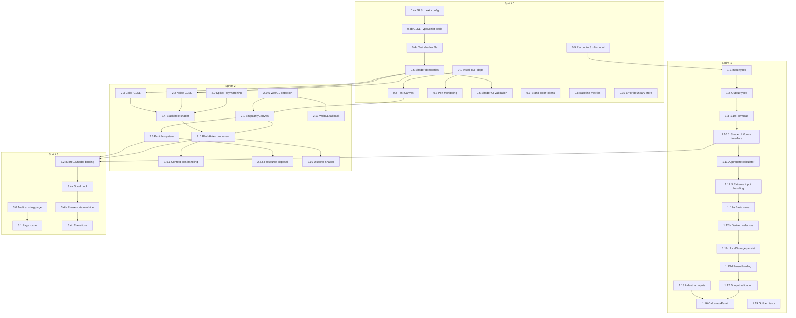

# THE VARIANCE TAX PROTOCOL: Sprint & Task Breakdown

> Engineering Industrial Fluidity for the 2026 Supply Chain Singularity

---

## Project Overview

**Goal:** Transform the YardFlow marketing site (`flow-state-site/`) into a high-fidelity "singularity event" experience that:
1. **Visceral:** Visually demonstrates the shift from "Variance" (Chaos/Black Hole) to "Fluidity" (Order/Network) using WebGL
2. **Rational:** Quantifies the "Variance Tax" using a rigorous, formula-backed economic calculator

**Tech Stack:**
- Framework: Next.js 16+ / React 19+
- 3D/Animation: `@react-three/fiber`, `@react-three/drei`, custom GLSL shaders
- State Management: `zustand` (already installed)
- Styling: Tailwind CSS, `framer-motion` (already installed)
- Testing: Playwright (E2E), tsx (unit tests)

**Brand Colors:**
- Void: `#050505` (existing)
- Neon: `#00B4FF` (existing → maps to Cerulean `#05ACEB`)
- Ember: `#FF2A00` (existing → maps to FreightRoll Red `#D91411`)
- Ebony Clay: `#232A35` (new background variant)

---

## ⚠️ Pre-Sprint Architectural Decision Required

**BLOCKING ISSUE:** The existing `DiagnosticCalculator.tsx` uses an **8-category cost model** (detention, cutoffs, OT, trailer hunt, chargebacks, overflow, safety, working capital) while this sprint plan proposes a **6-component model** (A-F from whitepaper).

**Resolution Required Before Sprint 1:**
1. Reconcile the two models (merge, replace, or parallel)
2. Document deprecation plan for old model if replaced
3. Update all existing references in the codebase

See Task 0.9 for implementation.

---

## Definition of Ready (All Tasks)

Before a task can be started, verify:
- [ ] All dependent tasks are marked complete
- [ ] Test data/fixtures exist (if applicable)
- [ ] Design mocks approved (if UI task)
- [ ] Technical spike completed (if high-risk task)
- [ ] Acceptance criteria are unambiguous

---

## Agent Responsibilities

| Agent | Domain | Owned Paths |
|-------|--------|-------------|
| **A - Economist** | Logic Layer | `/src/lib/varianceTax/**`, `/lib/varianceTax.ts` |
| **B - Visualist** | Presentation Layer | `/components/three/**`, `/shaders/**`, `/components/singularity/**` |
| **C - Architect** | Integration Layer | `/app/**`, `/components/ui/**`, project structure |
| **D - Gatekeeper** | Quality + CI | `/e2e/**`, `/__tests__/**`, CI config |
| **E - Closer** | Narrative + UX | Content files, microcopy, CTA flows |

---

## Dependency Graph (Critical Path)



---

## Sprint 0: Foundation & Infrastructure
**Goal:** Establish project scaffolding, dependencies, CI pipeline, and quality gates before feature work begins.

**Demoable Outcome:** CI pipeline runs successfully on push; dev server starts; baseline performance metrics captured.

**⚠️ Sprint 0 includes critical architectural decisions that block Sprint 1.**

---

### Task 0.1: Install Three.js Ecosystem Dependencies
**Agent:** C - Architect  
**Type:** Infrastructure  
**Estimated Effort:** Small (< 1 hour)

**Description:**  
Install `@react-three/fiber`, `@react-three/drei`, `three`, and TypeScript types.

**Acceptance Criteria:**
- [ ] Dependencies added to `package.json`
- [ ] `npm install` completes without errors
- [ ] TypeScript compiles without errors (`npm run build` passes)
- [ ] Simple R3F Canvas renders in dev mode (validation component)

**Validation:**
```bash
npm install @react-three/fiber @react-three/drei three @types/three
npm run build
```

**Rollback:** Remove dependencies from `package.json`, run `npm install`

**Notes:**
- Do NOT install `glsl-random` yet—Next.js 16 Turbopack may require different approach
- Verify R3F compatibility with React 19 (check release notes)

---

### Task 0.2: Create R3F Canvas Test Component
**Agent:** C - Architect  
**Type:** Scaffolding  
**Estimated Effort:** Small (< 1 hour)  
**Depends On:** 0.1

**Description:**  
Create a minimal R3F test component at `/components/three/TestCanvas.tsx` that renders a spinning cube. This validates the WebGL pipeline works.

**Acceptance Criteria:**
- [ ] Component renders without errors
- [ ] No console WebGL warnings
- [ ] Component is client-side only (`'use client'` directive)
- [ ] Renders a colored cube that rotates
- [ ] Works on Safari (manual verification)

**Validation:**
- Visual: Navigate to a test route, observe rotating cube
- Automated: Add Playwright test checking for canvas element

**Files:**
- Create: `/components/three/TestCanvas.tsx`
- Create: `/components/three/index.ts`
- Create: `/app/test-canvas/page.tsx` (temporary test route)

---

### Task 0.3: Configure Performance Monitoring Utilities
**Agent:** D - Gatekeeper  
**Type:** Infrastructure  
**Estimated Effort:** Medium (1-2 hours)  
**Depends On:** 0.1

**Description:**  
Add performance monitoring hooks using `@react-three/drei`'s `PerformanceMonitor` and create a custom FPS tracking hook.

**Acceptance Criteria:**
- [ ] `usePerformanceStore` Zustand store created for FPS/quality tier tracking
- [ ] Quality tiers defined: `'ultra' | 'high' | 'medium' | 'low'`
- [ ] Automatic tier degradation when FPS drops below 30
- [ ] **Hysteresis/dampening** to prevent tier thrashing (require 5 consecutive low FPS readings)
- [ ] Console logging of performance tier changes (dev only)

**Validation:**
- Manual: Throttle GPU in DevTools, observe tier degradation
- Unit test: `performanceStore.test.ts` validates tier transitions and hysteresis

**Files:**
- Create: `/src/lib/performance/performanceStore.ts`
- Create: `/src/lib/performance/index.ts`
- Create: `/src/lib/performance/__tests__/performanceStore.test.ts`

---

### Task 0.4a: Configure Next.js for GLSL Imports
**Agent:** C - Architect  
**Type:** Infrastructure  
**Estimated Effort:** Small (< 1 hour)

**Description:**  
Configure Next.js to import `.glsl`, `.vert`, `.frag` files as raw strings. **Verify Turbopack compatibility first.**

**Acceptance Criteria:**
- [ ] Research: Confirm approach works with Next.js 16 Turbopack (document in PR)
- [ ] Modify `next.config.js` with appropriate loader config
- [ ] Build passes with shader imports

**Validation:**
```bash
npm run build
```

**Files:**
- Modify: `next.config.js`

**Notes:**
- Turbopack may require `?raw` suffix instead of raw-loader
- If Turbopack incompatible, document fallback to Webpack

---

### Task 0.4b: Add GLSL TypeScript Declarations
**Agent:** C - Architect  
**Type:** Infrastructure  
**Estimated Effort:** Small (< 30 min)  
**Depends On:** 0.4a

**Description:**  
Add TypeScript declarations for shader file types.

**Acceptance Criteria:**
- [ ] TypeScript declarations added for `.glsl`, `.vert`, `.frag`
- [ ] No TypeScript errors when importing shader files

**Files:**
- Create: `/types/glsl.d.ts`

---

### Task 0.4c: Create Test Shader File
**Agent:** C - Architect  
**Type:** Scaffolding  
**Estimated Effort:** Small (< 30 min)  
**Depends On:** 0.4b

**Description:**  
Create a minimal test shader and import it to validate the pipeline.

**Acceptance Criteria:**
- [ ] Sample shader file created
- [ ] Successfully imported in a test component
- [ ] Import returns string type

**Validation:**
```typescript
import vertexShader from './shaders/test.vert';
console.assert(typeof vertexShader === 'string');
```

**Files:**
- Create: `/shaders/test.vert`
- Create: `/shaders/test.frag`

---

### Task 0.5: Establish Shader Directory Structure
**Agent:** B - Visualist  
**Type:** Scaffolding  
**Estimated Effort:** Small (< 1 hour)  
**Depends On:** 0.4c

**Description:**  
Create the shader directory structure with placeholder files and documentation.

**Acceptance Criteria:**
- [ ] Directory structure created: `/shaders/{blackhole,network,transition,common}/`
- [ ] README documenting shader conventions
- [ ] TypeScript types for shader uniforms interface

**Files:**
- Create: `/shaders/README.md`
- Create: `/shaders/blackhole/.gitkeep`
- Create: `/shaders/network/.gitkeep`
- Create: `/shaders/transition/.gitkeep`
- Create: `/shaders/common/.gitkeep`
- Create: `/src/lib/shaders/types.ts`

---

### Task 0.6: Extend CI Pipeline with Shader Compilation Check
**Agent:** D - Gatekeeper  
**Type:** CI/CD  
**Estimated Effort:** Medium (1-2 hours)  
**Depends On:** 0.5

**Description:**  
Add a CI step that validates all GLSL shaders compile without errors using a headless WebGL context.

**Acceptance Criteria:**
- [ ] Script validates all `.glsl`, `.vert`, `.frag` files in `/shaders/`
- [ ] Script runs in CI (uses headless-gl, ANGLE, or puppeteer-based validation)
- [ ] Exits with error code if any shader fails
- [ ] Clear error messages indicating which shader failed and line number

**Validation:**
```bash
npm run test:shaders
```

**Files:**
- Create: `/scripts/validate-shaders.ts`
- Modify: `package.json` (add `test:shaders` script)
- Modify: CI workflow (if exists)

---

### Task 0.7: Create Brand Color Token Extensions
**Agent:** E - Closer  
**Type:** Design System  
**Estimated Effort:** Small (< 1 hour)

**Description:**  
Extend `/lib/tokens.ts` and `tailwind.config.js` with the new Variance Tax color palette.

**Acceptance Criteria:**
- [ ] Colors added: `ebony-clay: #232A35`, `freightroll-red: #D91411`, `cerulean: #05ACEB`
- [ ] CSS custom properties generated
- [ ] Tailwind classes available: `bg-ebony-clay`, `text-freightroll-red`, `border-cerulean`
- [ ] Documentation updated with color semantics

**Files:**
- Modify: `/lib/tokens.ts`
- Modify: `/tailwind.config.js`

---

### Task 0.8: Establish Baseline Performance Metrics
**Agent:** D - Gatekeeper  
**Type:** Quality  
**Estimated Effort:** Medium (1-2 hours)

**Description:**  
Run Lighthouse on key pages and establish baseline metrics before 3D work begins.

**Acceptance Criteria:**
- [ ] Lighthouse scores captured for `/`, `/roi`, `/singularity`
- [ ] Results saved to `/docs/performance-baseline.json`
- [ ] Performance budgets defined (FCP < 2s, LCP < 3s, FPS > 30)
- [ ] CI check added to warn on regression (not block initially)

**Validation:**
```bash
npm run perf:baseline
```

**Files:**
- Create: `/scripts/capture-baseline.ts`
- Create: `/docs/performance-baseline.json`
- Modify: `package.json`

---

### Task 0.9: Reconcile Existing 8-Category Model with 6-Component Model ⚠️ BLOCKING
**Agent:** A - Economist  
**Type:** Architecture  
**Estimated Effort:** Large (4+ hours)

**Description:**  
The existing `DiagnosticCalculator.tsx` uses 8 cost categories. The whitepaper defines 6 components. This task reconciles the models.

**Current 8 Categories (from DiagnosticCalculator):**
1. Detention
2. Cutoffs (missed appointments)
3. Overtime labor
4. Trailer hunting
5. Chargebacks (OTIF)
6. Overflow spend
7. Safety/security
8. Working capital drag

**Proposed 6 Components (from whitepaper):**
- A: Recovery Cost (Premium Freight)
- B: Detention Cost
- C: Labor Variance Cost
- D: Chargeback Cost
- E: Working Capital Drag
- F: Lost Sales Risk

**Acceptance Criteria:**
- [ ] Mapping document created: which old categories map to which new components
- [ ] Decision documented: Replace, merge, or parallel systems
- [ ] If replacing: deprecation plan with timeline
- [ ] Migration path for existing `/roi` and `/diagnostic` pages
- [ ] Sign-off from stakeholder

**Files:**
- Create: `/docs/variance-tax-model-reconciliation.md`
- Modify: `/src/lib/economics/` (if needed)

**Blocks:** All Sprint 1 tasks

---

### Task 0.10: Create Error Boundary for Store Hydration
**Agent:** C - Architect  
**Type:** Resilience  
**Estimated Effort:** Small (< 1 hour)

**Description:**  
Create error boundary to handle Zustand store hydration failures (SSR/localStorage mismatch).

**Acceptance Criteria:**
- [ ] Error boundary wraps store provider
- [ ] Catches localStorage parse errors
- [ ] Falls back to default state on error
- [ ] Logs error to console (and Sentry if configured)
- [ ] User sees functional page, not crash

**Files:**
- Create: `/components/StoreErrorBoundary.tsx`

---

### Task 0.11: Configure jest-webgl-canvas-mock for Shader Tests
**Agent:** D - Gatekeeper  
**Type:** Testing Infrastructure  
**Estimated Effort:** Medium (1-2 hours)

**Description:**  
Set up WebGL mocking for Jest to enable shader unit testing.

**Acceptance Criteria:**
- [ ] `jest-webgl-canvas-mock` or equivalent installed
- [ ] Jest config updated
- [ ] Sample shader test passes
- [ ] Can test shader uniform updates

**Files:**
- Modify: `jest.config.js` (create if needed)
- Modify: `package.json`
- Create: `/src/lib/shaders/__tests__/setup.ts`

---

## Sprint 1: The Logic Core (The Economist)
**Goal:** Build the defensible economic engine with all Variance Tax formulas. No visuals yet—pure logic and UI shell.

**Demoable Outcome:** Interactive calculator panel that computes all 6 cost components of the Variance Tax in real-time. Outputs are unit-tested against known scenarios.

**Prerequisite:** Task 0.9 (model reconciliation) must be complete.

**Parallelization Note:** Tasks 1.3-1.10 (formula implementations) are **embarrassingly parallel** and can be assigned to multiple engineers simultaneously.

---

### Task 1.1: Define VarianceTaxInputs TypeScript Interface
**Agent:** A - Economist  
**Type:** Data Model  
**Estimated Effort:** Medium (1-2 hours)  
**Depends On:** 0.9

**Description:**  
Create the comprehensive TypeScript interface for all calculator inputs with JSDoc documentation citing industry sources.

**Acceptance Criteria:**
- [ ] Interface includes all atoms from whitepaper (see checklist below)
- [ ] Each field has JSDoc with source citation
- [ ] Validation constraints documented (min/max/step)
- [ ] Default values exported as separate constant

**Field Checklist (track progress):**
- [ ] `annualLoadVolume` (default: 20,000)
- [ ] `missedAppointmentRate` (default: 5% / 0.05)
- [ ] `spotPremium` (default: $450)
- [ ] `averageDwellTime` (default: 4.0 hrs)
- [ ] `freeTime` (default: 2.0 hrs)
- [ ] `detentionRate` (default: $75/hr)
- [ ] `detentionFrequency` (default: 15%)
- [ ] `laborRateGuard` (default: $30/hr)
- [ ] `laborRateJockey` (default: $25/hr)
- [ ] `manualCheckInMinutes` (default: 15 min)
- [ ] `digitalCheckInMinutes` (default: 2 min)
- [ ] `yardHuntingFrequency` (default: 10%)
- [ ] `yardHuntingMinutes` (default: 20 min)
- [ ] `chargebackRate` (default: 3%)
- [ ] `complianceFailureRate` (default: 3%)
- [ ] `averageInvoiceValue` (default: $25,000)
- [ ] `safetyStockDays` (default: 5 days)
- [ ] `dailyInventoryValue` (default: $100,000)
- [ ] `holdingCostRate` (default: 25%)
- [ ] `stockoutRisk` (default: 2%)
- [ ] `annualRevenue` (default: $50,000,000)
- [ ] `marginImpact` (default: 0.5)
- [ ] `currentTurnTimeMinutes` (default: 48 min)
- [ ] `targetTurnTimeMinutes` (default: 24 min)

**Files:**
- Create: `/src/lib/varianceTax/types.ts`
- Create: `/src/lib/varianceTax/defaults.ts`

---

### Task 1.2: Define VarianceTaxOutputs TypeScript Interface
**Agent:** A - Economist  
**Type:** Data Model  
**Estimated Effort:** Small (< 1 hour)  
**Depends On:** 1.1

**Description:**  
Create the output interface for calculated values.

**Acceptance Criteria:**
- [ ] Interface includes all derived outputs:
  - `recoveryCost` (Component A)
  - `detentionCost` (Component B)
  - `laborVarianceCost` (Component C)
  - `chargebackCost` (Component D)
  - `workingCapitalDrag` (Component E)
  - `lostSalesRisk` (Component F)
  - `totalVarianceTax`
  - `syntheticCapacityPercent`
  - `reynoldsScore` (0-1 for shader binding)
- [ ] Each field has JSDoc explaining the formula
- [ ] Optional breakdown sub-objects for detailed reporting

**Files:**
- Modify: `/src/lib/varianceTax/types.ts`

---

### Task 1.3: Implement Recovery Cost Formula (Component A)
**Agent:** A - Economist  
**Type:** Logic  
**Estimated Effort:** Small (< 1 hour)  
**Depends On:** 1.2  
**Parallelizable With:** 1.4, 1.5, 1.6, 1.7, 1.8

**Description:**  
Implement the Premium Freight Spend calculation.

**Formula:**
```
recoveryCost = annualLoadVolume × missedAppointmentRate × spotPremium
```

**Acceptance Criteria:**
- [ ] Pure function `calcRecoveryCost(inputs: VarianceTaxInputs): number`
- [ ] Handles edge cases (zero volume, 100% miss rate)
- [ ] Returns 0 for invalid inputs (negative values, NaN, Infinity)
- [ ] Unit test with 3+ scenarios matching expected outputs

**Validation (Test Cases):**
| Volume | Miss Rate | Premium | Expected |
|--------|-----------|---------|----------|
| 20000  | 0.05      | 450     | $450,000 |
| 10000  | 0.02      | 500     | $100,000 |
| 0      | 0.05      | 450     | $0       |
| -1000  | 0.05      | 450     | $0 (invalid) |

**Files:**
- Create: `/src/lib/varianceTax/formulas/recovery.ts`
- Create: `/src/lib/varianceTax/formulas/__tests__/recovery.test.ts`

---

### Task 1.4: Implement Detention Cost Formula (Component B)
**Agent:** A - Economist  
**Type:** Logic  
**Estimated Effort:** Small (< 1 hour)  
**Depends On:** 1.2  
**Parallelizable With:** 1.3, 1.5, 1.6, 1.7, 1.8

**Description:**  
Implement the Detention & Demurrage calculation.

**Formula:**
```
detentionCost = annualLoadVolume × detentionFrequency × max(0, averageDwellTime - freeTime) × detentionRate
```

**Acceptance Criteria:**
- [ ] Pure function `calcDetentionCost(inputs: VarianceTaxInputs): number`
- [ ] Only charges for time exceeding free time
- [ ] Handles edge case where dwell < free time (returns 0)
- [ ] Unit test with 3+ scenarios

**Validation (Test Cases):**
| Volume | Freq | Dwell | Free | Rate | Expected |
|--------|------|-------|------|------|----------|
| 20000  | 0.15 | 4.0   | 2.0  | 75   | $450,000 |
| 20000  | 0.15 | 1.5   | 2.0  | 75   | $0       |
| 10000  | 0.25 | 5.0   | 2.0  | 100  | $750,000 |

**Files:**
- Create: `/src/lib/varianceTax/formulas/detention.ts`
- Create: `/src/lib/varianceTax/formulas/__tests__/detention.test.ts`

---

### Task 1.5: Implement Labor Variance Formula (Component C)
**Agent:** A - Economist  
**Type:** Logic  
**Estimated Effort:** Small (< 1 hour)  
**Depends On:** 1.2  
**Parallelizable With:** 1.3, 1.4, 1.6, 1.7, 1.8

**Description:**  
Implement the Labor Variance (Viscosity Cost) calculation.

**Formula:**
```
gateWaste = annualLoadVolume × ((manualCheckInMinutes - digitalCheckInMinutes) / 60) × laborRateGuard
huntWaste = annualLoadVolume × yardHuntingFrequency × (yardHuntingMinutes / 60) × laborRateJockey
laborVarianceCost = gateWaste + huntWaste
```

**Acceptance Criteria:**
- [ ] Pure function `calcLaborVarianceCost(inputs: VarianceTaxInputs): LaborBreakdown`
- [ ] Returns breakdown object: `{ gateWaste, huntWaste, total }`
- [ ] Separates gate labor and hunting labor
- [ ] Unit test with 3+ scenarios

**Files:**
- Create: `/src/lib/varianceTax/formulas/labor.ts`
- Create: `/src/lib/varianceTax/formulas/__tests__/labor.test.ts`

---

### Task 1.6: Implement Chargeback Cost Formula (Component D)
**Agent:** A - Economist  
**Type:** Logic  
**Estimated Effort:** Small (< 1 hour)  
**Depends On:** 1.2  
**Parallelizable With:** 1.3, 1.4, 1.5, 1.7, 1.8

**Description:**  
Implement the OTIF Chargebacks & Penalties calculation.

**Formula:**
```
chargebackCost = annualLoadVolume × complianceFailureRate × averageInvoiceValue × chargebackRate
```

**Acceptance Criteria:**
- [ ] Pure function `calcChargebackCost(inputs: VarianceTaxInputs): number`
- [ ] Handles edge cases (0% failure rate)
- [ ] Unit test with 3+ scenarios

**Files:**
- Create: `/src/lib/varianceTax/formulas/chargeback.ts`
- Create: `/src/lib/varianceTax/formulas/__tests__/chargeback.test.ts`

---

### Task 1.7: Implement Working Capital Drag Formula (Component E)
**Agent:** A - Economist  
**Type:** Logic  
**Estimated Effort:** Small (< 1 hour)  
**Depends On:** 1.2  
**Parallelizable With:** 1.3, 1.4, 1.5, 1.6, 1.8

**Description:**  
Implement the Working Capital Drag calculation.

**Formula:**
```
workingCapitalDrag = safetyStockDays × dailyInventoryValue × holdingCostRate
```

**Acceptance Criteria:**
- [ ] Pure function `calcWorkingCapitalDrag(inputs: VarianceTaxInputs): number`
- [ ] Unit test with 3+ scenarios

**Files:**
- Create: `/src/lib/varianceTax/formulas/workingCapital.ts`
- Create: `/src/lib/varianceTax/formulas/__tests__/workingCapital.test.ts`

---

### Task 1.8: Implement Lost Sales Risk Formula (Component F)
**Agent:** A - Economist  
**Type:** Logic  
**Estimated Effort:** Small (< 1 hour)  
**Depends On:** 1.2  
**Parallelizable With:** 1.3, 1.4, 1.5, 1.6, 1.7

**Description:**  
Implement the Lost Sales Risk calculation.

**Formula:**
```
lostSalesRisk = annualRevenue × stockoutRisk × marginImpact
```

**Acceptance Criteria:**
- [ ] Pure function `calcLostSalesRisk(inputs: VarianceTaxInputs): number`
- [ ] Unit test with 3+ scenarios

**Files:**
- Create: `/src/lib/varianceTax/formulas/lostSales.ts`
- Create: `/src/lib/varianceTax/formulas/__tests__/lostSales.test.ts`

---

### Task 1.9: Implement Synthetic Capacity Formula
**Agent:** A - Economist  
**Type:** Logic  
**Estimated Effort:** Small (< 1 hour)  
**Depends On:** 1.2

**Description:**  
Implement the Synthetic Capacity hero metric.

**Formula:**
```
syntheticCapacityPercent = ((currentTurnTimeMinutes - targetTurnTimeMinutes) / currentTurnTimeMinutes) × 100
```

**Acceptance Criteria:**
- [ ] Pure function `calcSyntheticCapacity(current: number, target: number): number`
- [ ] Returns percentage (e.g., 50 for 50%)
- [ ] Handles edge case where target >= current (returns 0)
- [ ] Handles edge case where current = 0 (returns 0, avoid division by zero)
- [ ] Unit test with 3+ scenarios

**Files:**
- Create: `/src/lib/varianceTax/formulas/syntheticCapacity.ts`
- Create: `/src/lib/varianceTax/formulas/__tests__/syntheticCapacity.test.ts`

---

### Task 1.10: Implement Reynolds Score Derivation
**Agent:** A - Economist  
**Type:** Logic  
**Estimated Effort:** Small (< 1 hour)  
**Depends On:** 1.2

**Description:**  
Derive a normalized 0-1 "Reynolds Score" for shader binding from inputs.

**Formula:**
```
// Higher viscosity (manual processes) = higher Reynolds = more turbulent
viscosityScore = (manualCheckInMinutes - digitalCheckInMinutes) / manualCheckInMinutes
densityScore = clamp(averageDwellTime / 8, 0, 1)  // 8 hrs = max density
velocityScore = clamp(annualLoadVolume / 100000, 0, 1)  // 100k = max velocity
reynoldsScore = (viscosityScore × 0.5) + (densityScore × 0.3) + (velocityScore × 0.2)
```

**Acceptance Criteria:**
- [ ] Pure function `calcReynoldsScore(inputs: VarianceTaxInputs): number`
- [ ] Returns value clamped between 0 and 1
- [ ] Higher score = more turbulent (worse)
- [ ] Unit test with boundary conditions

**Files:**
- Create: `/src/lib/varianceTax/formulas/reynolds.ts`
- Create: `/src/lib/varianceTax/formulas/__tests__/reynolds.test.ts`

---

### Task 1.10.5: Define ShaderUniforms TypeScript Interface
**Agent:** A - Economist + B - Visualist  
**Type:** Contract  
**Estimated Effort:** Small (< 30 min)  
**Depends On:** 1.10

**Description:**  
Define the interface contract between the economics layer and the visualization layer.

**Acceptance Criteria:**
- [ ] Interface defines: `uViscosity`, `uProgress`, `uTime`, `uResolution`
- [ ] Type aliases for uniform values (e.g., `type Uniform0to1 = number`)
- [ ] Shared between `/src/lib/varianceTax/` and `/src/lib/shaders/`
- [ ] JSDoc explaining each uniform's purpose and range

**Files:**
- Create: `/src/lib/shaders/uniforms.ts`
- Modify: `/src/lib/varianceTax/types.ts` (import and use)

---

### Task 1.11: Create Aggregate Calculator Function
**Agent:** A - Economist  
**Type:** Logic  
**Estimated Effort:** Medium (1-2 hours)  
**Depends On:** 1.3, 1.4, 1.5, 1.6, 1.7, 1.8, 1.9, 1.10

**Description:**  
Create the main `calcVarianceTax` function that aggregates all components.

**Acceptance Criteria:**
- [ ] Function signature: `calcVarianceTax(inputs: VarianceTaxInputs): VarianceTaxOutputs`
- [ ] Calls all individual formula functions
- [ ] Computes `totalVarianceTax` as sum of all components
- [ ] Includes `reynoldsScore` for shader binding
- [ ] Comprehensive unit test with full scenario

**Files:**
- Create: `/src/lib/varianceTax/calculator.ts`
- Create: `/src/lib/varianceTax/__tests__/calculator.test.ts`
- Create: `/src/lib/varianceTax/index.ts` (exports)

---

### Task 1.11.5: Implement Extreme Input Handling
**Agent:** A - Economist  
**Type:** Resilience  
**Estimated Effort:** Small (< 1 hour)  
**Depends On:** 1.11

**Description:**  
Handle extreme/edge-case input combinations that could cause numeric issues.

**Acceptance Criteria:**
- [ ] Cap outputs at reasonable maximums (e.g., $1B)
- [ ] Handle NaN/Infinity in intermediate calculations
- [ ] Return warnings array for edge cases (e.g., "Inputs may be unrealistic")
- [ ] Unit tests for: 1M loads, 100% failure rates, $0 revenue

**Files:**
- Modify: `/src/lib/varianceTax/calculator.ts`
- Create: `/src/lib/varianceTax/__tests__/extremeInputs.test.ts`

---

### Task 1.12a: Create Basic VarianceTax Zustand Store
**Agent:** A - Economist  
**Type:** State Management  
**Estimated Effort:** Small (< 1 hour)  
**Depends On:** 1.11.5

**Description:**  
Create the basic Zustand store that holds inputs.

**Acceptance Criteria:**
- [ ] Store interface matches `VarianceTaxInputs`
- [ ] Actions: `setInput(key, value)`, `resetToDefaults()`
- [ ] Store is typed correctly with TypeScript
- [ ] Basic unit test

**Files:**
- Create: `/src/lib/varianceTax/store.ts`
- Create: `/src/lib/varianceTax/__tests__/store.test.ts`

---

### Task 1.12b: Add Derived Selectors to Store
**Agent:** A - Economist  
**Type:** State Management  
**Estimated Effort:** Small (< 1 hour)  
**Depends On:** 1.12a

**Description:**  
Add derived selectors that compute outputs from inputs.

**Acceptance Criteria:**
- [ ] Selector: `useVarianceTaxOutputs()` returns `VarianceTaxOutputs`
- [ ] Memoized to avoid recalculation on unrelated state changes
- [ ] Unit test verifying reactivity

**Files:**
- Modify: `/src/lib/varianceTax/store.ts`

---

### Task 1.12c: Add localStorage Persistence to Store
**Agent:** A - Economist  
**Type:** State Management  
**Estimated Effort:** Small (< 1 hour)  
**Depends On:** 1.12b

**Description:**  
Add optional localStorage persistence using Zustand middleware.

**Acceptance Criteria:**
- [ ] Uses `zustand/middleware/persist`
- [ ] Graceful fallback on parse errors (handled by Task 0.10)
- [ ] Version key for migration
- [ ] Can be disabled via prop/config

**Files:**
- Modify: `/src/lib/varianceTax/store.ts`

---

### Task 1.12d: Add Preset Loading to Store
**Agent:** A - Economist  
**Type:** State Management  
**Estimated Effort:** Small (< 1 hour)  
**Depends On:** 1.12c

**Description:**  
Add industry preset loading capability.

**Acceptance Criteria:**
- [ ] Action: `loadPreset(presetId: PresetId)`
- [ ] Presets defined in separate file (see Task 4.3)
- [ ] Preset indicator stored in state

**Files:**
- Modify: `/src/lib/varianceTax/store.ts`
- Create: `/src/lib/varianceTax/presets.ts` (stub, full content in Sprint 4)

---

### Task 1.12.5: Add Input Validation Error States
**Agent:** A - Economist  
**Type:** Validation  
**Estimated Effort:** Small (< 1 hour)  
**Depends On:** 1.12d

**Description:**  
Add validation error handling for invalid user inputs.

**Acceptance Criteria:**
- [ ] Validation function: `validateInputs(inputs): ValidationResult`
- [ ] Error types: `out-of-range`, `invalid-type`, `unrealistic-combination`
- [ ] Store exposes `errors` state
- [ ] UI can display per-field errors

**Files:**
- Create: `/src/lib/varianceTax/validation.ts`
- Modify: `/src/lib/varianceTax/store.ts`
- Create: `/src/lib/varianceTax/__tests__/validation.test.ts`

---

### Task 1.13: Create Industrial Input Components Suite
**Agent:** C - Architect  
**Type:** UI Component  
**Estimated Effort:** Medium (2-3 hours)

**Description:**  
Create the "industrial" styled input components: slider, switch, and numeric input.

**Acceptance Criteria:**

**Slider (`IndustrialSlider`):**
- [ ] Props: `label`, `value`, `onChange`, `min`, `max`, `step`, `unit`, `hint`
- [ ] Visual: Dark track, neon accent, JetBrains Mono value display
- [ ] Accessible: Keyboard navigable (arrow keys), ARIA labels
- [ ] Responsive: Touch-friendly on mobile (44px touch target)
- [ ] Reduced motion: No animations when `prefers-reduced-motion`

**Switch (`IndustrialSwitch`):**
- [ ] Props: `label`, `checked`, `onChange`, `description`
- [ ] Visual: Carbon background, neon glow when active
- [ ] Accessible: Role="switch", keyboard toggle (Space/Enter)

**Numeric Input (`IndustrialNumericInput`):**
- [ ] Props: `label`, `value`, `onChange`, `min`, `max`, `step`, `unit`, `prefix`
- [ ] Visual: Monospace font, dark input, subtle glow on focus
- [ ] Validation: Clamps to min/max, shows error state for invalid
- [ ] Increment/decrement buttons

**Files:**
- Create: `/components/ui/IndustrialSlider.tsx`
- Create: `/components/ui/IndustrialSwitch.tsx`
- Create: `/components/ui/IndustrialNumericInput.tsx`
- Create: `/components/ui/__tests__/IndustrialInputs.test.tsx` (accessibility tests)

---

### Task 1.14: Create CalculatorPanel Container Component
**Agent:** C - Architect  
**Type:** UI Component  
**Estimated Effort:** Medium (2-3 hours)  
**Depends On:** 1.12.5, 1.13

**Description:**  
Create the main calculator panel that assembles all inputs.

**Acceptance Criteria:**
- [ ] Uses VarianceTax store for state
- [ ] Groups inputs logically:
  - Operations (volume, dwell, turn time)
  - Labor (rates, times)
  - Compliance (chargebacks, failure rates)
  - Financial (revenue, inventory)
- [ ] Collapsible sections for mobile
- [ ] Real-time output display in header
- [ ] Responsive: Drawer on mobile, sidebar on desktop
- [ ] Shows validation errors per field

**Files:**
- Create: `/components/singularity/CalculatorPanel.tsx`

---

### Task 1.15: Create TaxBreakdown Summary Component
**Agent:** C - Architect  
**Type:** UI Component  
**Estimated Effort:** Medium (1-2 hours)  
**Depends On:** 1.14

**Description:**  
Create the breakdown table showing each cost component.

**Acceptance Criteria:**
- [ ] Displays all 6 components (A-F) with labels and values
- [ ] Hover tooltip explains each formula
- [ ] Animated number transitions (framer-motion)
- [ ] Total row highlighted
- [ ] Export button (JSON download of scenario)
- [ ] Respects `prefers-reduced-motion` for animations

**Files:**
- Create: `/components/singularity/TaxBreakdown.tsx`

---

### Task 1.16: Create Rolling Number Animation Hook
**Agent:** C - Architect  
**Type:** Animation  
**Estimated Effort:** Small (< 1 hour)

**Description:**  
Create a hook for smooth number transitions when values change.

**Acceptance Criteria:**
- [ ] Hook: `useRollingNumber(value: number, duration?: number): number`
- [ ] Uses framer-motion's `useSpring` or `useMotionValue`
- [ ] Respects `prefers-reduced-motion` (instant transition)
- [ ] Returns current animated value
- [ ] Verify React 19 compatibility

**Files:**
- Create: `/lib/hooks/useRollingNumber.ts`
- Create: `/lib/hooks/__tests__/useRollingNumber.test.ts`

---

### Task 1.17: Write Golden Test Suite for Calculator
**Agent:** D - Gatekeeper  
**Type:** Testing  
**Estimated Effort:** Medium (1-2 hours)  
**Depends On:** 1.11

**Description:**  
Create a comprehensive test suite with "golden" scenarios that lock in expected outputs.

**Acceptance Criteria:**
- [ ] At least 5 distinct scenarios:
  - Small shipper (5k loads)
  - Mid-market (50k loads)
  - Enterprise (200k loads)
  - Worst-case (high variance)
  - Best-case (optimized)
- [ ] Each scenario has locked expected output values
- [ ] Tests fail if formulas change unexpectedly
- [ ] Snapshot test for full output object
- [ ] Document "golden update workflow" for intentional formula changes

**Files:**
- Create: `/src/lib/varianceTax/__tests__/golden.test.ts`
- Create: `/docs/golden-test-update-procedure.md`

---

### Task 1.18: Add Calculator E2E Test
**Agent:** D - Gatekeeper  
**Type:** Testing  
**Estimated Effort:** Medium (1-2 hours)  
**Depends On:** 1.14

**Description:**  
Add Playwright test that validates calculator UI functionality.

**Acceptance Criteria:**
- [ ] Test navigates to calculator page
- [ ] Adjusts slider input
- [ ] Verifies output updates
- [ ] Tests reset button
- [ ] Tests preset loading
- [ ] Tests keyboard navigation

**Files:**
- Create: `/e2e/calculator.spec.ts`

---

## Sprint 2: The Visual Singularity (The Visualist)
**Goal:** Create the "Black Hole" and "Particle Network" WebGL visualizations with shader-driven transitions.

**Demoable Outcome:** Full-screen 3D canvas showing black hole that dissolves into network grid based on hardcoded viscosity value. Smooth 60fps on modern hardware (M1 MacBook / RTX 2060 equivalent).

**⚠️ High-Risk Sprint:** Shader work is unpredictable. Build in 2-day buffer for debugging. Mid-sprint checkpoint recommended after Task 2.5.

**Safari Testing:** All visual tasks require Safari verification (WebGL implementation differs significantly).

---

### Task 2.0: Spike - Raymarching Reference Implementation
**Agent:** B - Visualist  
**Type:** Research/Spike  
**Estimated Effort:** Large (4-8 hours)

**Description:**  
Research and prototype raymarching black hole shader before committing to full implementation.

**Acceptance Criteria:**
- [ ] Review 3 reference implementations (document links)
- [ ] Prototype simplified SDF sphere with lensing effect
- [ ] Validate shader compiles in R3F context
- [ ] Measure FPS on low-end device (identify perf floor)
- [ ] Document recommended approach with trade-offs

**Output:**
- `/docs/spike-raymarching-results.md`
- `/shaders/blackhole/prototype.frag` (throwaway)

**Blocks:** Task 2.4

---

### Task 2.0.5: Define WebGL Feature Detection Matrix
**Agent:** B - Visualist  
**Type:** Technical Design  
**Estimated Effort:** Small (< 1 hour)

**Description:**  
Define which WebGL features are required vs. optional and detection logic.

**Acceptance Criteria:**
- [ ] Document: WebGL1 vs WebGL2 feature usage
- [ ] List optional features (e.g., float textures, instancing)
- [ ] Detection function: `getWebGLCapabilities(): Capabilities`
- [ ] Map capabilities to quality tiers

**Files:**
- Create: `/src/lib/webgl/capabilities.ts`
- Create: `/docs/webgl-feature-matrix.md`

---

### Task 2.1: Create R3F Scene Container Component
**Agent:** B - Visualist  
**Type:** 3D Foundation  
**Estimated Effort:** Medium (2-3 hours)  
**Depends On:** 0.2, 2.0.5

**Description:**  
Create the main R3F Canvas wrapper with camera, lighting, and performance monitoring.

**Acceptance Criteria:**
- [ ] Full-screen canvas with transparent background
- [ ] OrthographicCamera or PerspectiveCamera configured
- [ ] PerformanceMonitor from drei integrated
- [ ] Suspense boundary with loading fallback
- [ ] Error boundary for WebGL failures

**Files:**
- Create: `/components/three/SingularityCanvas.tsx`

---

### Task 2.2: Implement Noise GLSL Utilities
**Agent:** B - Visualist  
**Type:** Shader

**Description:**  
Implement common noise functions for shader use.

**Acceptance Criteria:**
- [ ] Simplex 2D/3D noise
- [ ] Curl noise for flow fields
- [ ] FBM (Fractal Brownian Motion) wrapper
- [ ] All functions tested in isolation

**Files:**
- Create: `/shaders/common/noise.glsl`
- Create: `/shaders/common/fbm.glsl`

---

### Task 2.3: Implement Color Interpolation GLSL Utilities
**Agent:** B - Visualist  
**Type:** Shader

**Description:**  
Create color interpolation helpers.

**Acceptance Criteria:**
- [ ] HSL to RGB conversion
- [ ] Smooth color lerp
- [ ] Brand color constants as vec3

**Files:**
- Create: `/shaders/common/color.glsl`

---

### Task 2.4: Create Black Hole Raymarching Fragment Shader
**Agent:** B - Visualist  
**Type:** Shader

**Description:**  
Implement the Schwarzschild black hole raymarching shader.

**Acceptance Criteria:**
- [ ] Uniforms: `uTime`, `uViscosity`, `uResolution`
- [ ] Gravitational lensing effect
- [ ] Accretion disk with noise-based turbulence
- [ ] Disk color interpolates Red → Blue based on `uViscosity`
- [ ] Event horizon darkness at center
- [ ] Compiles without errors

**Files:**
- Create: `/shaders/blackhole/blackhole.frag`
- Create: `/shaders/blackhole/blackhole.vert`

---

### Task 2.5: Create Black Hole React Component
**Agent:** B - Visualist  
**Type:** 3D Component

**Description:**  
Create R3F component that renders the black hole shader on a full-screen quad.

**Acceptance Criteria:**
- [ ] Uses `shaderMaterial` from drei
- [ ] Passes uniforms from props/store
- [ ] Updates `uTime` in useFrame
- [ ] Handles resize gracefully
- [ ] Graceful fallback if shader fails

**Files:**
- Create: `/components/three/BlackHole.tsx`

---

### Task 2.6: Create Particle System Base Component
**Agent:** B - Visualist  
**Type:** 3D Component

**Description:**  
Create instanced mesh particle system for network visualization.

**Acceptance Criteria:**
- [ ] Uses `InstancedMesh` for 5000+ particles
- [ ] Custom shader for particle coloring
- [ ] Position buffer with Float32Array
- [ ] Color buffer for per-particle color
- [ ] Scale buffer for per-particle size

**Files:**
- Create: `/components/three/ParticleNetwork.tsx`
- Create: `/shaders/network/particle.vert`
- Create: `/shaders/network/particle.frag`

---

### Task 2.7: Implement Chaos Movement Pattern
**Agent:** B - Visualist  
**Type:** Animation Logic

**Description:**  
Implement noise-based chaotic particle movement for high-viscosity state.

**Acceptance Criteria:**
- [ ] Particles orbit with varying radii
- [ ] Curl noise adds turbulence
- [ ] Velocity variance is high
- [ ] Movement syncs with black hole rotation

**Files:**
- Modify: `/components/three/ParticleNetwork.tsx`

---

### Task 2.8: Implement Flow Field Movement Pattern
**Agent:** B - Visualist  
**Type:** Animation Logic

**Description:**  
Implement structured flow field for low-viscosity state.

**Acceptance Criteria:**
- [ ] Particles align into grid lanes
- [ ] Smooth, laminar movement vectors
- [ ] Reduced velocity variance
- [ ] Visual representation of "yard lanes"

**Files:**
- Modify: `/components/three/ParticleNetwork.tsx`

---

### Task 2.9: Implement Particle Color Transition
**Agent:** B - Visualist  
**Type:** Visual Polish

**Description:**  
Interpolate particle colors based on viscosity.

**Acceptance Criteria:**
- [ ] High viscosity: FreightRoll Red (#D91411)
- [ ] Low viscosity: Cerulean Blue (#05ACEB)
- [ ] Smooth HSL interpolation
- [ ] Glow intensity varies with color

**Files:**
- Modify: `/shaders/network/particle.frag`

---

### Task 2.10: Create Dissolve Transition Shader
**Agent:** B - Visualist  
**Type:** Shader

**Description:**  
Implement noise-based dissolve effect for black hole → network transition.

**Acceptance Criteria:**
- [ ] Uniform: `uProgress` (0 = full black hole, 1 = full network)
- [ ] Uses Perlin noise for dissolve pattern
- [ ] Edge glow during transition
- [ ] Smooth 2-second transition duration

**Files:**
- Create: `/shaders/transition/dissolve.glsl`
- Modify: `/components/three/BlackHole.tsx`

---

### Task 2.11: Create Quality Tier Manager
**Agent:** B - Visualist  
**Type:** Performance

**Description:**  
Implement quality tier system for different hardware capabilities.

**Acceptance Criteria:**
- [ ] Tiers: `ultra` (5000 particles), `high` (2500), `medium` (1000), `low` (500)
- [ ] Auto-detects based on FPS
- [ ] Manual override in settings
- [ ] Shader complexity scales with tier

**Files:**
- Create: `/components/three/QualityManager.tsx`
- Modify: `/src/lib/performance/performanceStore.ts`

---

### Task 2.12: Implement Starfield Background
**Agent:** B - Visualist  
**Type:** Visual Polish

**Description:**  
Create subtle starfield background that gets gravitationally lensed.

**Acceptance Criteria:**
- [ ] Procedural star generation
- [ ] Stars distort near black hole
- [ ] Subtle twinkle animation
- [ ] Low performance impact

**Files:**
- Create: `/components/three/Starfield.tsx`

---

### Task 2.13: Add WebGL Fallback Component
**Agent:** B - Visualist  
**Type:** Accessibility

**Description:**  
Create graceful fallback for devices without WebGL support.

**Acceptance Criteria:**
- [ ] Detects WebGL availability
- [ ] Shows static gradient image as fallback
- [ ] Displays message about WebGL requirement
- [ ] Calculator still functional without 3D

**Files:**
- Create: `/components/three/WebGLFallback.tsx`
- Modify: `/components/three/SingularityCanvas.tsx`

---

### Task 2.14: Implement Reduced Motion Support
**Agent:** D - Gatekeeper  
**Type:** Accessibility

**Description:**  
Ensure 3D scene respects `prefers-reduced-motion`.

**Acceptance Criteria:**
- [ ] Hook detects `prefers-reduced-motion: reduce`
- [ ] When true: particles static, no rotation, no dissolve animation
- [ ] Black hole shows static state based on viscosity
- [ ] All transitions instant

**Files:**
- Create: `/lib/hooks/useReducedMotion.ts`
- Modify: `/components/three/BlackHole.tsx`
- Modify: `/components/three/ParticleNetwork.tsx`

---

### Task 2.15: Create 3D Scene E2E Smoke Test
**Agent:** D - Gatekeeper  
**Type:** Testing

**Description:**  
Add Playwright test that validates 3D scene loads without errors.

**Acceptance Criteria:**
- [ ] Test navigates to singularity page
- [ ] Waits for canvas element
- [ ] No console errors related to WebGL
- [ ] Screenshot comparison for visual regression

**Files:**
- Create: `/e2e/singularity-3d.spec.ts`

---

### Task 2.16: Profile and Optimize Shader Performance
**Agent:** D - Gatekeeper  
**Type:** Performance

**Description:**  
Profile shader performance and optimize bottlenecks.

**Acceptance Criteria:**
- [ ] Document current FPS on reference hardware
- [ ] Identify top 3 performance bottlenecks
- [ ] Optimize shader loops
- [ ] Verify 60fps on M1 MacBook / RTX 2060 equivalent

**Files:**
- Create: `/docs/shader-performance-report.md`

---

## Sprint 3: Integration & Polish (The Architect)
**Goal:** Fuse logic and visuals into a cohesive narrative experience with scroll-driven storytelling.

**Demoable Outcome:** Complete landing page where scrolling through the narrative causes the 3D scene to transform from black hole to network as the calculator inputs improve.

**Feature Flag:** Consider implementing behind feature flag for gradual rollout.

---

### Task 3.0: Audit Existing Singularity Page
**Agent:** C - Architect  
**Type:** Analysis  
**Estimated Effort:** Medium (1-2 hours)

**Description:**  
The existing `/app/singularity/page.tsx` has 661 lines of code. Audit and document what to preserve vs. replace.

**Acceptance Criteria:**
- [ ] Document existing features and their purposes
- [ ] Identify code to preserve (e.g., preset loading, network visualization)
- [ ] Identify code to replace (e.g., canvas implementation)
- [ ] Create migration plan with minimal disruption
- [ ] Note any API dependencies

**Files:**
- Create: `/docs/singularity-migration-plan.md`

**Blocks:** Task 3.1

---

### Task 3.1: Create Singularity Page Route
**Agent:** C - Architect  
**Type:** Routing  
**Estimated Effort:** Medium (2-3 hours)  
**Depends On:** 3.0

**Description:**  
Update the `/app/singularity/page.tsx` with new layout structure while preserving useful existing functionality.

**Acceptance Criteria:**
- [ ] Page renders without errors
- [ ] Metadata configured (title, description, OG image)
- [ ] Suspense boundaries for 3D and calculator
- [ ] Loading state while 3D initializes
- [ ] Existing useful features preserved per migration plan

**Files:**
- Modify: `/app/singularity/page.tsx`
- Create: `/app/singularity/loading.tsx`

---

### Task 3.2: Connect VarianceTax Store to Shader Uniforms
**Agent:** C - Architect  
**Type:** Integration  
**Estimated Effort:** Medium (1-2 hours)  
**Depends On:** 1.10.5, 2.5, 2.6

**Description:**  
Create reactive binding between Zustand store and 3D scene.

**Acceptance Criteria:**
- [ ] Custom hook: `useVarianceTaxUniforms(): ShaderUniforms`
- [ ] Returns `uViscosity`, `uProgress`, `uColor`
- [ ] Derives `uViscosity` from `reynoldsScore`
- [ ] Updates in real-time as store changes
- [ ] No unnecessary re-renders (memoized)
- [ ] Integration test: verify uniform updates propagate to shader

**Files:**
- Create: `/lib/hooks/useVarianceTaxUniforms.ts`
- Create: `/lib/hooks/__tests__/useVarianceTaxUniforms.test.ts`

---

### Task 3.3: Implement Hero Section Layout
**Agent:** C - Architect  
**Type:** Layout  
**Estimated Effort:** Medium (2-3 hours)

**Description:**  
Create the hero section with full-screen 3D canvas and overlay text.

**Acceptance Criteria:**
- [ ] 3D canvas fills viewport
- [ ] Text overlay: "THE VARIANCE TAX" headline
- [ ] Subtext: "Why 2026 Demands Industrial Fluidity"
- [ ] Scroll indicator at bottom (animated, respects reduced-motion)
- [ ] Text readable against 3D background (use text shadow or backdrop)
- [ ] Mobile responsive

**Files:**
- Create: `/components/singularity/HeroSection.tsx`

---

### Task 3.4a: Create Scroll Progress Tracking Hook
**Agent:** C - Architect  
**Type:** Animation  
**Estimated Effort:** Small (< 1 hour)

**Description:**  
Create hook to track scroll position as normalized 0-1 value.

**Acceptance Criteria:**
- [ ] Hook: `useScrollProgress(): number`
- [ ] Returns 0 at top, 1 at bottom of scroll container
- [ ] Debounced/throttled for performance
- [ ] Works with both page scroll and scroll container

**Files:**
- Create: `/lib/hooks/useScrollProgress.ts`

---

### Task 3.4b: Create Phase State Machine
**Agent:** C - Architect  
**Type:** Animation  
**Estimated Effort:** Medium (1-2 hours)  
**Depends On:** 3.4a

**Description:**  
Create state machine for managing the 3 scroll phases.

**Acceptance Criteria:**
- [ ] State: `'thesis' | 'audit' | 'solution'`
- [ ] Transitions based on scroll progress:
  - Thesis: 0-0.33
  - Audit: 0.33-0.66
  - Solution: 0.66-1.0
- [ ] Exposes `phase` and `phaseProgress` (0-1 within phase)
- [ ] Hysteresis to prevent flickering at boundaries

**Files:**
- Create: `/lib/hooks/usePhaseState.ts`

---

### Task 3.4c: Implement Phase Transition Animations
**Agent:** C - Architect  
**Type:** Animation  
**Estimated Effort:** Medium (2-3 hours)  
**Depends On:** 3.4b

**Description:**  
Implement smooth transitions between phases.

**Acceptance Criteria:**
- [ ] Content fades in/out between phases
- [ ] 3D scene parameters update smoothly
- [ ] Calculator panel animates in during Audit phase
- [ ] Respects `prefers-reduced-motion`
- [ ] Test on mobile Safari (scroll behavior differs)

**Files:**
- Create: `/components/singularity/ScrollController.tsx`

---

### Task 3.5: Create Phase 1: Thesis Section
**Agent:** E - Closer  
**Type:** Content  
**Estimated Effort:** Medium (2-3 hours)

**Description:**  
Create the introductory narrative section.

**Acceptance Criteria:**
- [ ] Copy explains the "Great Reset" context
- [ ] Introduces Reynolds Number concept simply
- [ ] Uses approved terminology (protocol, standardization, system)
- [ ] Animated text reveal on scroll

**Files:**
- Create: `/components/singularity/ThesisSection.tsx`

---

### Task 3.6: Create Phase 2: Audit Section
**Agent:** C - Architect  
**Type:** Layout

**Description:**  
Create the calculator section with real-time 3D feedback.

**Acceptance Criteria:**
- [ ] Calculator panel positioned as overlay
- [ ] Black hole reacts to input changes
- [ ] Tax breakdown visible alongside
- [ ] Clear CTA to continue scrolling

**Files:**
- Create: `/components/singularity/AuditSection.tsx`

---

### Task 3.7: Create Phase 3: Solution Section
**Agent:** E - Closer  
**Type:** Content

**Description:**  
Create the resolution section showing the network state.

**Acceptance Criteria:**
- [ ] Scene has transitioned to particle network
- [ ] Displays Synthetic Capacity metric prominently
- [ ] Explains the YardFlow protocol solution
- [ ] Strong CTA: "Book a Network Audit"

**Files:**
- Create: `/components/singularity/SolutionSection.tsx`

---

### Task 3.8: Implement Mobile Calculator Drawer
**Agent:** C - Architect  
**Type:** Responsive

**Description:**  
Create a collapsible drawer for calculator on mobile.

**Acceptance Criteria:**
- [ ] Drawer slides up from bottom
- [ ] Drag handle for open/close
- [ ] Partial open state showing totals
- [ ] Full open for all inputs
- [ ] Touch-friendly input controls

**Files:**
- Create: `/components/singularity/MobileCalculatorDrawer.tsx`

---

### Task 3.9: Add Audio Feedback (Optional)
**Agent:** B - Visualist  
**Type:** Polish

**Description:**  
Add subtle audio that crossfades based on state.

**Acceptance Criteria:**
- [ ] Low-frequency hum for variance state
- [ ] Clean synth pulse for flow state
- [ ] Muted by default, opt-in toggle
- [ ] Respects system audio preferences

**Files:**
- Create: `/components/singularity/AudioManager.tsx`
- Create: `/public/audio/variance-hum.mp3`
- Create: `/public/audio/flow-pulse.mp3`

---

### Task 3.10: Implement Keyboard Navigation
**Agent:** D - Gatekeeper  
**Type:** Accessibility

**Description:**  
Ensure entire experience is keyboard navigable.

**Acceptance Criteria:**
- [ ] Tab order follows logical flow
- [ ] Arrow keys adjust sliders
- [ ] Enter/Space toggles switches
- [ ] Escape closes drawers
- [ ] Focus indicators visible

**Files:**
- Modify: `/components/singularity/CalculatorPanel.tsx`
- Modify: `/components/ui/IndustrialSlider.tsx`

---

### Task 3.11: Add Page Performance Optimizations
**Agent:** D - Gatekeeper  
**Type:** Performance

**Description:**  
Optimize page load and runtime performance.

**Acceptance Criteria:**
- [ ] 3D canvas lazy-loaded on scroll
- [ ] Calculator code-split
- [ ] Images use next/image with proper sizing
- [ ] Font preloading configured
- [ ] LCP < 3 seconds on 4G

**Files:**
- Modify: `/app/singularity/page.tsx`

---

### Task 3.12: Create OG Image for Singularity Page
**Agent:** C - Architect  
**Type:** SEO

**Description:**  
Generate a compelling OG image for social sharing.

**Acceptance Criteria:**
- [ ] 1200x630 image with black hole aesthetic
- [ ] "THE VARIANCE TAX" text overlay
- [ ] YardFlow branding
- [ ] Meta tags configured

**Files:**
- Create: `/app/singularity/opengraph-image.tsx`

---

### Task 3.13: Add Structured Data (JSON-LD)
**Agent:** C - Architect  
**Type:** SEO

**Description:**  
Add schema.org structured data for the page.

**Acceptance Criteria:**
- [ ] WebPage schema
- [ ] SoftwareApplication schema for YardFlow
- [ ] Organization schema
- [ ] Validates in Google Rich Results Test

**Files:**
- Modify: `/app/singularity/page.tsx`

---

### Task 3.14: Write Comprehensive E2E Test Suite
**Agent:** D - Gatekeeper  
**Type:** Testing

**Description:**  
Create full E2E test suite for singularity page.

**Acceptance Criteria:**
- [ ] Test page load
- [ ] Test scroll interactions
- [ ] Test calculator input changes
- [ ] Test mobile drawer
- [ ] Test accessibility (axe-core)

**Files:**
- Create: `/e2e/singularity-full.spec.ts`

---

### Task 3.15: Document Component APIs
**Agent:** C - Architect  
**Type:** Documentation

**Description:**  
Document all new components with JSDoc and usage examples.

**Acceptance Criteria:**
- [ ] All components have JSDoc
- [ ] Props documented with types
- [ ] Usage examples in comments
- [ ] README in `/components/singularity/`

**Files:**
- Create: `/components/singularity/README.md`

---

## Sprint 4: Narrative & Conversion Polish (The Closer)
**Goal:** Refine copy, CTAs, and user journey to maximize conversion.

**Demoable Outcome:** Complete narrative flow with polished copy, clear CTAs, and objection-crushing sequencing.

---

### Task 4.1: Audit All Copy for Tone Compliance
**Agent:** E - Closer  
**Type:** Content

**Description:**  
Review all copy for brand tone compliance.

**Acceptance Criteria:**
- [ ] No banned words: "easy", "simple", "app"
- [ ] Uses preferred words: "protocol", "standardization", "system", "deterministic"
- [ ] Executive/Industrial tone throughout
- [ ] All claims are measurable and CFO-safe

**Files:**
- Modify: All copy in `/components/singularity/`

---

### Task 4.2: Create Formula Explanation Tooltips
**Agent:** E - Closer  
**Type:** UX

**Description:**  
Add tooltips explaining each formula in plain language.

**Acceptance Criteria:**
- [ ] Each cost component has expandable explanation
- [ ] Explains inputs and calculation
- [ ] Cites data sources
- [ ] Non-technical language

**Files:**
- Modify: `/components/singularity/TaxBreakdown.tsx`

---

### Task 4.3: Implement Industry Preset Selector
**Agent:** E - Closer  
**Type:** UX

**Description:**  
Add preset scenarios for different industries.

**Acceptance Criteria:**
- [ ] Presets: Retail DC, Manufacturing, CPG, 3PL, Intermodal
- [ ] One-click load with realistic defaults
- [ ] Preset indicator in UI
- [ ] Clear option to customize

**Files:**
- Create: `/src/lib/varianceTax/presets.ts`
- Modify: `/components/singularity/CalculatorPanel.tsx`

---

### Task 4.4: Create "Model Your Network" CTA Flow
**Agent:** E - Closer  
**Type:** Conversion

**Description:**  
Implement the primary conversion CTA flow.

**Acceptance Criteria:**
- [ ] CTA button: "Model Your Network"
- [ ] Links to /contact with pre-filled context
- [ ] Passes calculated values as URL params
- [ ] Contact form shows personalized message

**Files:**
- Modify: `/components/singularity/SolutionSection.tsx`
- Modify: `/app/contact/page.tsx`

---

### Task 4.5: Add PDF Export for Tax Breakdown
**Agent:** E - Closer  
**Type:** Feature

**Description:**  
Allow users to export their Variance Tax audit as PDF.

**Acceptance Criteria:**
- [ ] "Export Audit" button
- [ ] Generates branded PDF with all calculations
- [ ] Includes assumptions and sources
- [ ] Filename includes date

**Files:**
- Create: `/src/lib/varianceTax/exportPdf.ts`
- Modify: `/components/singularity/TaxBreakdown.tsx`

---

### Task 4.6: Create Objection-Handling Callouts
**Agent:** E - Closer  
**Type:** Content

**Description:**  
Add callout boxes addressing common objections.

**Acceptance Criteria:**
- [ ] "Why not just negotiate rates?"
- [ ] "We already have a YMS"
- [ ] "Our yards are too complex"
- [ ] Each has concise, data-backed response

**Files:**
- Create: `/components/singularity/ObjectionCallout.tsx`

---

### Task 4.7: Add Trust Signals
**Agent:** E - Closer  
**Type:** Conversion

**Description:**  
Add credibility markers throughout the page.

**Acceptance Criteria:**
- [ ] "200K+ drivers" proof point
- [ ] "58 facilities live" metric
- [ ] "Built by FreightRoll" badge
- [ ] Security compliance badges (if applicable)

**Files:**
- Modify: `/components/singularity/HeroSection.tsx`

---

### Task 4.8: Implement Exit-Intent Capture
**Agent:** E - Closer  
**Type:** Conversion

**Description:**  
Add exit-intent modal for lead capture.

**Acceptance Criteria:**
- [ ] Triggers on mouse leaving viewport (desktop)
- [ ] Offers to save/email audit results
- [ ] Minimal form: email only
- [ ] One-time trigger per session
- [ ] Rate-limited to prevent abuse

**Files:**
- Create: `/components/singularity/ExitIntentModal.tsx`

---

### Task 4.9: Implement Number Formatting Localization
**Agent:** E - Closer  
**Type:** Internationalization  
**Estimated Effort:** Medium (1-2 hours)

**Description:**  
Ensure calculator outputs are properly formatted for different locales.

**Acceptance Criteria:**
- [ ] Currency formatting uses `Intl.NumberFormat`
- [ ] Detects user locale automatically
- [ ] Supports USD, EUR, GBP formatting
- [ ] Decimal separators respect locale (. vs ,)
- [ ] Unit tests for major locales

**Files:**
- Create: `/src/lib/varianceTax/format.ts`
- Modify: `/components/singularity/TaxBreakdown.tsx`

---

### Task 4.10: Sanitize URL Parameters for Contact Form
**Agent:** D - Gatekeeper  
**Type:** Security  
**Estimated Effort:** Small (< 1 hour)  
**Depends On:** 4.4

**Description:**  
Prevent XSS attacks via URL parameters passed to contact form.

**Acceptance Criteria:**
- [ ] All URL params sanitized before display
- [ ] Numeric values validated as numbers
- [ ] String values HTML-escaped
- [ ] Maximum length enforced
- [ ] Security test added

**Files:**
- Create: `/lib/security/sanitizeParams.ts`
- Modify: `/app/contact/page.tsx`
- Create: `/lib/security/__tests__/sanitizeParams.test.ts`

---

### Task 4.11: Add Visual Regression Testing for PDF Export
**Agent:** D - Gatekeeper  
**Type:** Testing  
**Estimated Effort:** Medium (1-2 hours)  
**Depends On:** 4.5

**Description:**  
Verify PDF export output is consistent.

**Acceptance Criteria:**
- [ ] Snapshot test for PDF structure
- [ ] Verify all required sections present
- [ ] Test with different input scenarios
- [ ] Verify no data leakage (only expected fields)

**Files:**
- Create: `/src/lib/varianceTax/__tests__/exportPdf.test.ts`

---

## Sprint 5: Domain Cutover & Production Hardening
**Goal:** Launch to production with proper DNS, redirects, and monitoring.

**Demoable Outcome:** Site live on production domain with all quality gates passing.

---

### Task 5.1: Configure Vercel Production Deployment
**Agent:** C - Architect  
**Type:** Infrastructure

**Description:**  
Set up Vercel project configuration for production.

**Acceptance Criteria:**
- [ ] Production branch set to `main`
- [ ] Environment variables configured
- [ ] Build settings optimized
- [ ] Preview deployments on PRs

**Files:**
- Modify: `/vercel.json`

---

### Task 5.2: Configure DNS CNAME Record
**Agent:** C - Architect  
**Type:** Infrastructure

**Description:**  
Set up DNS to point marketing site subdomain to Vercel.

**Acceptance Criteria:**
- [ ] CNAME record for `www.freightroll.com` → Vercel
- [ ] Or dedicated subdomain like `yardflow.freightroll.com`
- [ ] TTL set appropriately (300 seconds initially)
- [ ] DNS propagation verified globally

**Validation:**
```bash
dig www.freightroll.com CNAME
```

---

### Task 5.3: Configure SSL/TLS and HSTS
**Agent:** D - Gatekeeper  
**Type:** Security

**Description:**  
Ensure HTTPS is enforced with proper HSTS headers.

**Acceptance Criteria:**
- [ ] HTTPS enforced (redirect HTTP → HTTPS)
- [ ] HSTS header present
- [ ] No mixed content warnings
- [ ] SSL Labs grade A or higher

**Validation:**
```bash
curl -I https://www.freightroll.com
```

---

### Task 5.4: Configure Canonical URLs and Redirects
**Agent:** C - Architect  
**Type:** SEO

**Description:**  
Set up proper redirects for canonical host.

**Acceptance Criteria:**
- [ ] Single canonical host (www or apex)
- [ ] 301 redirects for non-canonical
- [ ] No redirect loops
- [ ] Old URLs redirect to new structure

**Files:**
- Modify: `/vercel.json` (redirects section)
- Modify: `/next.config.js`

---

### Task 5.5: Verify Sitemap and Robots.txt
**Agent:** C - Architect  
**Type:** SEO

**Description:**  
Ensure sitemap and robots.txt are correct for marketing site.

**Acceptance Criteria:**
- [ ] `/sitemap.xml` accessible and valid
- [ ] `/robots.txt` allows crawling
- [ ] Sitemap includes all public pages
- [ ] No app routes leaked to marketing sitemap

**Validation:**
```bash
curl https://www.freightroll.com/sitemap.xml
curl https://www.freightroll.com/robots.txt
```

---

### Task 5.6: Submit to Google Search Console
**Agent:** C - Architect  
**Type:** SEO

**Description:**  
Verify ownership and submit sitemap to GSC.

**Acceptance Criteria:**
- [ ] Domain verified in GSC
- [ ] Sitemap submitted
- [ ] No crawl errors
- [ ] Initial indexing requested

---

### Task 5.7: Configure Analytics and Tracking
**Agent:** C - Architect  
**Type:** Analytics

**Description:**  
Set up PostHog/analytics for the new pages.

**Acceptance Criteria:**
- [ ] Page views tracked
- [ ] Calculator interactions tracked
- [ ] CTA clicks tracked
- [ ] Scroll depth tracked
- [ ] No PII in events

**Files:**
- Modify: `/components/AnalyticsProvider.tsx`
- Create: `/lib/analytics/singularityEvents.ts`

---

### Task 5.8: Run Production Lighthouse Audit
**Agent:** D - Gatekeeper  
**Type:** Quality

**Description:**  
Run Lighthouse on production and verify metrics.

**Acceptance Criteria:**
- [ ] Performance score > 70
- [ ] Accessibility score > 90
- [ ] Best Practices score > 90
- [ ] SEO score > 90
- [ ] No critical issues

---

### Task 5.9: Document Rollback Procedure
**Agent:** D - Gatekeeper  
**Type:** Operations

**Description:**  
Document how to rollback in case of issues.

**Acceptance Criteria:**
- [ ] Step-by-step rollback procedure
- [ ] DNS revert instructions
- [ ] Vercel rollback to previous deployment
- [ ] < 5 minute rollback time
- [ ] Contact list for emergencies

**Files:**
- Create: `/docs/rollback-procedure.md`

---

### Task 5.10a: Configure Sentry Error Tracking
**Agent:** D - Gatekeeper  
**Type:** Monitoring  
**Estimated Effort:** Medium (1-2 hours)

**Description:**  
Set up Sentry for error tracking, especially for 3D scene failures.

**Acceptance Criteria:**
- [ ] Sentry SDK installed and configured
- [ ] Source maps uploaded for debugging
- [ ] WebGL context loss errors tracked with context
- [ ] Shader compilation errors captured
- [ ] Error alerts configured for critical paths

**Files:**
- Create: `/lib/sentry.ts`
- Modify: `/app/layout.tsx`
- Modify: `next.config.js` (source maps)

---

### Task 5.10b: Add PostHog Custom Events
**Agent:** D - Gatekeeper  
**Type:** Analytics  
**Estimated Effort:** Small (< 1 hour)

**Description:**  
Add custom PostHog events for singularity page interactions.

**Acceptance Criteria:**
- [ ] Event: `quality_tier_downgrade` (with tier info)
- [ ] Event: `calculator_interaction` (which input changed)
- [ ] Event: `phase_transition` (which phase)
- [ ] Event: `cta_click` (which CTA)
- [ ] Event: `pdf_export`

**Files:**
- Modify: `/lib/analytics/singularityEvents.ts`

---

### Task 5.10c: Configure Uptime Monitoring
**Agent:** D - Gatekeeper  
**Type:** Monitoring  
**Estimated Effort:** Small (< 1 hour)

**Description:**  
Set up external uptime monitoring.

**Acceptance Criteria:**
- [ ] Uptime checks configured (e.g., Checkly, UptimeRobot)
- [ ] Check interval: 3 minutes
- [ ] Endpoints monitored: `/`, `/singularity`, `/api/health`
- [ ] Alert channels configured (email, Slack)
- [ ] Status page updated (if exists)

---

### Task 5.10d: Create Health Check Endpoint
**Agent:** C - Architect  
**Type:** Infrastructure  
**Estimated Effort:** Small (< 1 hour)

**Description:**  
Create API health check endpoint for monitoring.

**Acceptance Criteria:**
- [ ] Endpoint: `/api/health`
- [ ] Returns `{ status: 'ok', version: string, timestamp: string }`
- [ ] Returns 200 for healthy, 503 for unhealthy
- [ ] Fast response (< 50ms)

**Files:**
- Create: `/app/api/health/route.ts`

---

### Task 5.11: Run Full Regression Test on Production
**Agent:** D - Gatekeeper  
**Type:** Testing

**Description:**  
Run E2E tests against production environment.

**Acceptance Criteria:**
- [ ] All route smoke tests pass
- [ ] Calculator tests pass
- [ ] 3D scene loads
- [ ] Forms submit successfully (dry-run)
- [ ] No console errors

---

### Task 5.12: Create Launch Checklist Document
**Agent:** D - Gatekeeper  
**Type:** Documentation

**Description:**  
Create final launch checklist with sign-off.

**Acceptance Criteria:**
- [ ] All tasks verified complete
- [ ] Sign-off from each agent role
- [ ] Launch date confirmed
- [ ] Communication plan documented

**Files:**
- Create: `/docs/launch-checklist.md`

---

### Task 5.13: Implement Feature Flag for 3D Content
**Agent:** C - Architect  
**Type:** Risk Mitigation  
**Estimated Effort:** Small (< 1 hour)

**Description:**  
Add feature flag to enable gradual rollout and quick disable of 3D content.

**Acceptance Criteria:**
- [ ] Feature flag: `ENABLE_3D_SINGULARITY`
- [ ] Configurable via environment variable
- [ ] Falls back to static version when disabled
- [ ] Can be toggled without redeploy (if using flag service)

**Files:**
- Create: `/lib/featureFlags.ts`
- Modify: `/components/three/SingularityCanvas.tsx`

---

## Definition of Done (All Tasks)

Every task must meet these criteria before merge:

1. ✅ Acceptance criteria met
2. ✅ Tests included (unit, E2E, or manual validation documented)
3. ✅ No TypeScript errors (`npm run build` passes)
4. ✅ No lint errors (`npm run lint` passes)
5. ✅ CI passes all checks
6. ✅ Performance budget respected (Gatekeeper sign-off)
7. ✅ Mobile/touch verified (Safari included)
8. ✅ Reduced-motion path verified
9. ✅ Rollback note or guardrail documented
10. ✅ PR approved by relevant code owners

---

## Merge Rules

- All work lands via PR to `main`
- Branch protection enabled on `main`
- Required checks: `typecheck`, `lint`, `test`, `build`, `test:e2e`, `test:shaders`
- Required approvals:
  - Formulas/state changes → Economist + Gatekeeper
  - Shader/render changes → Visualist + Gatekeeper
  - Routing/SEO changes → Architect + Gatekeeper
  - Copy/content changes → Closer + Gatekeeper

---

## CODEOWNERS

```
/src/lib/varianceTax/**  @economist @gatekeeper
/src/lib/economics/**    @economist @gatekeeper
/src/lib/webgl/**        @visualist @gatekeeper
/src/lib/shaders/**      @visualist @gatekeeper
/components/three/**     @visualist @gatekeeper
/shaders/**              @visualist @gatekeeper
/app/**                  @architect @gatekeeper
/components/ui/**        @architect @gatekeeper
/components/singularity/**  @architect @visualist @gatekeeper
/lib/security/**         @gatekeeper
*.md                     @closer @gatekeeper
```

---

## Task Summary

| Sprint | Tasks | Focus Area |
|--------|-------|------------|
| Sprint 0 | 11 tasks | Infrastructure & Scaffolding |
| Sprint 1 | 21 tasks | Economic Logic & Calculator UI |
| Sprint 2 | 20 tasks | WebGL Visualizations |
| Sprint 3 | 18 tasks | Integration & Scroll Experience |
| Sprint 4 | 11 tasks | Narrative & Conversion |
| Sprint 5 | 16 tasks | Production & Launch |
| **Total** | **97 tasks** | |

---

## Risk Register

| Risk | Likelihood | Impact | Mitigation |
|------|------------|--------|------------|
| Shader performance issues on mobile | High | High | Task 2.0 spike, quality tiers, Task 2.16 profiling |
| WebGL context loss crashes | Medium | High | Task 2.5.1 context loss handling |
| Next.js 16 Turbopack incompatibility | Medium | Medium | Task 0.4a includes compatibility research |
| Scroll hijack UX issues on Safari | Medium | Medium | Task 3.4c Safari testing requirement |
| Formula disagreement with stakeholders | Low | High | Task 0.9 model reconciliation (blocking) |
| Memory leaks in 3D scene | Medium | Medium | Task 2.6.5 resource disposal |

---

## Appendix: Formula Reference

### Component A: Recovery Cost
```
recoveryCost = annualLoadVolume × missedAppointmentRate × spotPremium
```

### Component B: Detention Cost
```
detentionCost = annualLoadVolume × detentionFrequency × max(0, averageDwellTime - freeTime) × detentionRate
```

### Component C: Labor Variance Cost
```
gateWaste = annualLoadVolume × ((manualCheckInMinutes - digitalCheckInMinutes) / 60) × laborRateGuard
huntWaste = annualLoadVolume × yardHuntingFrequency × (yardHuntingMinutes / 60) × laborRateJockey
laborVarianceCost = gateWaste + huntWaste
```

### Component D: Chargeback Cost
```
chargebackCost = annualLoadVolume × complianceFailureRate × averageInvoiceValue × chargebackRate
```

### Component E: Working Capital Drag
```
workingCapitalDrag = safetyStockDays × dailyInventoryValue × holdingCostRate
```

### Component F: Lost Sales Risk
```
lostSalesRisk = annualRevenue × stockoutRisk × marginImpact
```

### Synthetic Capacity
```
syntheticCapacityPercent = ((currentTurnTimeMinutes - targetTurnTimeMinutes) / currentTurnTimeMinutes) × 100
```

### Reynolds Score (Shader Binding)
```
viscosityScore = (manualCheckInMinutes - digitalCheckInMinutes) / manualCheckInMinutes
densityScore = clamp(averageDwellTime / 8, 0, 1)
velocityScore = clamp(annualLoadVolume / 100000, 0, 1)
reynoldsScore = (viscosityScore × 0.5) + (densityScore × 0.3) + (velocityScore × 0.2)
```

---

*Document generated: 2026-01-21*
*Version: 1.0*
