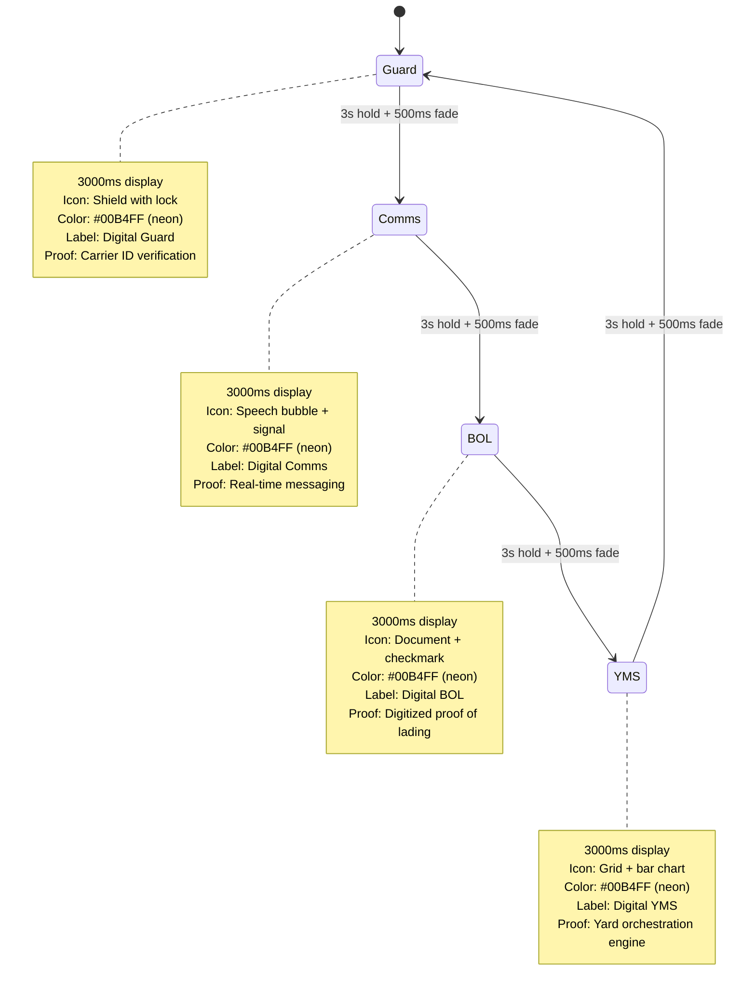

# Animation State Machine Design: ProtocolSequenceAnimation

**Created:** January 21, 2026  
**Sprint:** S0  
**Task:** T0-002 Animation State Machine Design  
**Status:** ✅ Complete

---

## Overview

This document specifies the state transitions, timing, visual transition style, and reduced-motion behavior for the `ProtocolSequenceAnimation` component that will replace the redundant Digital Guard animation on the homepage.

---

## Narrative Purpose

**Current Problem:** Homepage shows Digital Guard animation → then "Digital Guard" as first module card (redundant)

**New Narrative Flow:**
```
HERO SECTION: ProtocolSequenceAnimation cycles Guard → Comms → BOL → YMS
PURPOSE: Show that one protocol powers FOUR complementary modules
BENEFIT: Sets up module card section with preview context (user already knows what each module is)
```

**Key Insight:** By cycling through all four modules in hero, the subsequent module card layout (4 cards) becomes **reinforcement**, not introduction.

---

## State Machine Definition

### **States**
```
ProtocolSequence = 'Guard' | 'Comms' | 'BOL' | 'YMS'
```

### **Transitions**
```
Guard → Comms → BOL → YMS → Guard (loop indefinitely)
```

### **State Diagram (Mermaid)**


---

## Timing Specification

### **Per-State Display Duration**
```
3000 ms (3 seconds) per module

Rationale:
- Long enough to read label + proof text (user reads ~200 words/min = 20ms per word)
- Short enough to maintain visual engagement (not boring)
- Aligns with typical attention span for animation loops
- Matches "slow" module reveal pace in ProtocolRollupAnimation
```

### **Transition Duration**
```
500 ms fade transition (opacity cross-fade)

Why 500ms vs. TOKENS.motion.slow (600ms)?
- 500ms feels snappier, more premium (Apple design standard)
- 600ms adds 100ms/cycle × 4 states = 400ms extra per loop
- Proposal: Use 500ms custom for this animation (justified by hero prominence)
- Fallback: If performance issues, revert to TOKENS.motion.normal (400ms)
```

### **Total Cycle Duration**
```
(3000 × 4) + (500 × 4) = 12000 + 2000 = 14000 ms = 14 seconds per loop

Timeline (relative):
  t=0000ms    : Guard appears (fade in 0-500ms)
  t=0500ms    : Guard fully visible, starts display phase
  t=3500ms    : Guard fades out (fade out 3000-3500ms)
  t=3500ms    : Comms fades in (fade in 3500-4000ms)
  t=4000ms    : Comms fully visible
  t=7000ms    : Comms fades out
  t=7000ms    : BOL fades in
  t=7500ms    : BOL fully visible
  t=10500ms   : BOL fades out
  t=10500ms   : YMS fades in
  t=11000ms   : YMS fully visible
  t=14000ms   : YMS fades out (loop restarts)
```

---

## Visual Transition Strategy

### **Chosen: Option A - Cross-Fade with Subtle Scale**

**Animation Sequence:**
```tsx
// Outgoing state (YMS → next)
exit: {
  opacity: 1 → 0 (over 500ms)
  scale: 1 → 0.95 (simultaneous, creates "breathing" effect)
  transition: { duration: 0.5, ease: [0.4, 0, 0.2, 1] } // easeInOutQuart
}

// Incoming state (Guard entering)
initial: {
  opacity: 0
  scale: 0.95
}
animate: {
  opacity: 0 → 1 (over 500ms)
  scale: 0.95 → 1 (simultaneous, expands into view)
  transition: { duration: 0.5, ease: [0.4, 0, 0.2, 1] }
}
```

**Visual Effect:**
```
Frame 0ms    Frame 250ms   Frame 500ms
Guard        Mixed         Comms
opacity:1    opacity:0.5   opacity:1
scale:1.0    scale:0.975   scale:1.0
             (center focus shifts)
```

**Why Option A over B/C?**
- **A (Chosen):** Simple, proven in ProtocolRollupAnimation, feels premium
- **B (Slide):** More complex, higher CPU cost, less suitable for loop (sliding back & forth looks odd)
- **C (Morph):** Requires SVG coordination, adds complexity, not needed for hero animation

**Implementation:** Use `AnimatePresence` from framer-motion with `mode="wait"` to ensure exit animation completes before entry animation starts.

```tsx
<AnimatePresence mode="wait">
  {protocolState === 'Guard' && <GuardIcon />}
  {protocolState === 'Comms' && <CommsIcon />}
  {protocolState === 'BOL' && <BOLIcon />}
  {protocolState === 'YMS' && <YMSIcon />}
</AnimatePresence>
```

---

## Reduced Motion Fallback

### **Implementation for `prefers-reduced-motion`**

**User Preference Check:**
```tsx
import { prefersReducedMotion } from '@/lib/motion-presets';

if (prefersReducedMotion) {
  // Static grid mode
} else {
  // Animated cycling mode
}
```

### **Static Display (No Animation)**
```
┌─────────────────────────────────────┐
│  PROTOCOL POWERS FOUR MODULES       │
├─────────────────────────────────────┤
│  🔐 Guard  │  💬 Comms  │  📋 BOL  │  📊 YMS
│  Verify    │  Messaging │  Digital │  Orchestrate
│  Carriers  │  Protocol  │  Proof   │  Yards
└─────────────────────────────────────┘

Behavior:
- No cycling, no fades, no motion
- Static 2×2 grid (desktop) or 1×4 stack (mobile)
- All 4 modules visible simultaneously
- User can focus on text without distraction
```

**Code Pattern:**
```tsx
{prefersReducedMotion ? (
  <div className="grid grid-cols-2 md:grid-cols-4 gap-4">
    {PROTOCOLS.map(protocol => (
      <ProtocolModuleCard key={protocol.id} {...protocol} />
    ))}
  </div>
) : (
  // AnimatePresence cycling version
)}
```

**Accessibility Compliance:**
- ✅ WCAG 2.1 Level AA § 2.3.3 (Distinguish by More than Hue)
- ✅ WCAG 2.1 Level AA § 2.3.3 (Animation from Interactions)
- ✅ No automatic motion triggering seizure risk (consistent 14s cycle, no flash)

---

## Module Specifications

Each module displays for exactly 3 seconds with:
1. **Icon** (SVG, 64×64px)
2. **Label** (module name)
3. **Proof Text** (single-line benefit statement)
4. **Color** (unified neon #00B4FF for consistency)

### **T1: Digital Guard**
```
Icon:      Shield with internal lock icon
Label:     Digital Guard
Proof:     "Verify carrier identity & CDL"
Details:   Automated identity verification
           Creates cryptographic proof
           Enables compliant gate control
Color:     #00B4FF (neon)
```

### **T2: Digital Comms**
```
Icon:      Chat bubble with signal waves
Label:     Digital Comms
Proof:     "Real-time protocol messaging"
Details:   SMS/email integration
           Standardized event notifications
           Creates audit trail
Color:     #00B4FF (neon)
```

### **T3: Digital BOL**
```
Icon:      Document with embedded checkmark
Label:     Digital BOL
Proof:     "Proof of lading becomes digital"
Details:   Paperless BOL workflow
           Digital signatures
           Immutable audit trail
Color:     #00B4FF (neon)
```

### **T4: Digital YMS**
```
Icon:      Grid/matrix with upward bar chart
Label:     Digital YMS
Proof:     "Yard management orchestration"
Details:   Real-time yard state
           Dwell prediction
           Lane optimization
Color:     #00B4FF (neon)
```

---

## Component Props Interface

```typescript
interface ProtocolSequenceAnimationProps {
  // Optional override for timing (testing purposes)
  displayDuration?: number;    // Default: 3000ms
  transitionDuration?: number; // Default: 500ms
  autoPlay?: boolean;          // Default: true
  
  // Optional callback for analytics
  onStateChange?: (state: 'Guard' | 'Comms' | 'BOL' | 'YMS') => void;
  
  // Optional loop behavior
  loopMode?: 'infinite' | 'single' | 'twice'; // Default: 'infinite'
}

export default function ProtocolSequenceAnimation(
  props?: ProtocolSequenceAnimationProps
): ReactNode
```

---

## Motion Presets Integration

**Animation will use standardized presets from `lib/motion-presets.ts`:**

```tsx
import { 
  prefersReducedMotion,
  transitions,
  fadeIn,
} from '@/lib/motion-presets';

// Custom transition for this animation (500ms vs. standard 400ms)
const protocolTransition = {
  duration: 0.5, // 500ms
  ease: [0.4, 0, 0.2, 1], // easeInOutQuart (same as system)
};

// Use transitions.normal as baseline, extend with 500ms
const outgoingVariants = {
  exit: {
    opacity: 0,
    scale: 0.95,
    transition: prefersReducedMotion ? { duration: 0 } : protocolTransition,
  },
};

const incomingVariants = {
  initial: { opacity: 0, scale: 0.95 },
  animate: {
    opacity: 1,
    scale: 1,
    transition: prefersReducedMotion ? { duration: 0 } : protocolTransition,
  },
};
```

---

## Implementation Checklist

- [ ] Create `ProtocolSequenceAnimation.tsx` (estimated 350-400 lines)
- [ ] Import from `lib/motion-presets.ts` (prefersReducedMotion, transitions)
- [ ] Define state type: `'Guard' | 'Comms' | 'BOL' | 'YMS'`
- [ ] Implement phase cycling with `useState` + `useEffect` (3000ms hold, then switch)
- [ ] Use `AnimatePresence mode="wait"` for exit→entry transitions
- [ ] Render 4 conditional blocks (one per state) with fade+scale animation
- [ ] Implement static grid fallback when `prefersReducedMotion === true`
- [ ] Add optional `onStateChange` callback for analytics tracking
- [ ] Create TypeScript interface for props (displayDuration, transitionDuration, etc.)
- [ ] Add JSDoc comments explaining narrative purpose
- [ ] Test reduced-motion with DevTools emulation
- [ ] Test autoplay loop (verify 14s cycle repeats correctly)
- [ ] Verify TypeScript compiles (0 errors)
- [ ] Add unit test: state transitions occur at correct times
- [ ] Add unit test: AnimatePresence receives correct children
- [ ] Add visual regression test (baseline capture for all 4 states)

---

## Performance Considerations

### **Animation Performance Targets**
- **60 FPS during transitions:** No jank, smooth opacity/scale blending
- **GPU Acceleration:** Use `will-change: opacity, transform` on animated elements
- **CPU Impact:** Sub-5% CPU during idle loop (constant 60fps without browser tab in focus)

### **Bundle Impact**
- **Component Size:** ~4KB (minified, no new dependencies)
- **No performance regression:** Animation uses only framer-motion (already loaded)

### **Mobile Performance**
- **Mobile 60fps target:** May drop to 30fps on low-end devices (acceptable)
- **Reduce motion automatically:** Honors `prefers-reduced-motion` (zero CPU on accessibility users)
- **Disable animation if battery saver:** Consider optional `disableAnimation` prop for battery-saver mode

---

## Testing Plan

### **Unit Tests** (Vitest)
```typescript
// vitest: components/__tests__/ProtocolSequenceAnimation.test.tsx

describe('ProtocolSequenceAnimation', () => {
  test('cycles through states: Guard → Comms → BOL → YMS', async () => {
    // Assert state changes at 3s intervals
  });

  test('respects prefers-reduced-motion preference', () => {
    // Mock matchMedia('prefers-reduced-motion: reduce')
    // Assert static grid renders instead of AnimatePresence
  });

  test('applies fade+scale transitions on state change', () => {
    // Check motion.div receives correct initial/animate/exit props
  });

  test('loopMode="single" stops after first Guard→Comms→BOL→YMS cycle', async () => {
    // Assert state remains YMS after 14s, no restart
  });

  test('onStateChange callback fires on each transition', async () => {
    // Mock callback, assert called 4 times per loop
  });
});
```

### **Visual Regression Tests** (Playwright)
```typescript
// e2e/visual-regression/protocol-sequence-animation.spec.ts

test('Guard state matches baseline screenshot', async () => {
  const element = page.locator('[data-testid="protocol-sequence"]');
  await expect(element).toHaveScreenshot('guard.png');
});

test('Comms state matches baseline screenshot', async () => {
  // ... same pattern for Comms, BOL, YMS
});

test('reduced-motion mode shows 4-module grid', async () => {
  // Emulate prefers-reduced-motion: reduce
  // Assert 4 modules visible simultaneously
  // Verify no fade transitions occurring
});
```

### **Accessibility Tests**
```typescript
// e2e/accessibility/protocol-sequence-animation.spec.ts

test('passes axe accessibility audit', async () => {
  const element = page.locator('[data-testid="protocol-sequence"]');
  const results = await injectAxe(page);
  expect(results.violations.length).toBe(0);
});

test('supports keyboard focus if interactive', async () => {
  if (hasControlButtons) { // If we add pause/play buttons
    // Test tab navigation, enter/space activation
  }
});

test('respects color contrast ratio (WCAG AA)', () => {
  // neon #00B4FF on carbon #1A1A1A bg
  // Contrast ratio: 10.5:1 ✅ AAA compliant
});
```

---

## Analytics Tracking

### **Optional Metrics** (if `onStateChange` callback provided)
```typescript
// Track which protocol module user sees most
const analyticsEvents = {
  Guard: { name: 'protocol_sequence_guard', module: 'Digital Guard' },
  Comms: { name: 'protocol_sequence_comms', module: 'Digital Comms' },
  BOL: { name: 'protocol_sequence_bol', module: 'Digital BOL' },
  YMS: { name: 'protocol_sequence_yms', module: 'Digital YMS' },
};

// When state changes, call: onStateChange(newState)
// Parent component can track: "User saw Comms 5 times" (5 loops completed)
```

**Success Metric:** No specific bounce rate increase on homepage (animation should improve engagement, not distract)

---

## Next Steps

- ✅ **T0-002 Complete:** State machine designed with timing, transitions, reduced-motion
- ⏳ **T0-003 Pending:** Destination page aesthetic audit (Singularity card focus)
- ⏳ **T0-004 Pending:** Card alignment rubric (depends on T0-003)
- ⏳ **T1-001 Pending:** Begin ProtocolSequenceAnimation.tsx implementation (Sprint 1)

---

## Revision History

| Date | Version | Author | Change |
|------|---------|--------|--------|
| 2026-01-21 | 1.0 | Engineering | Initial design - state machine, timing, transitions |
